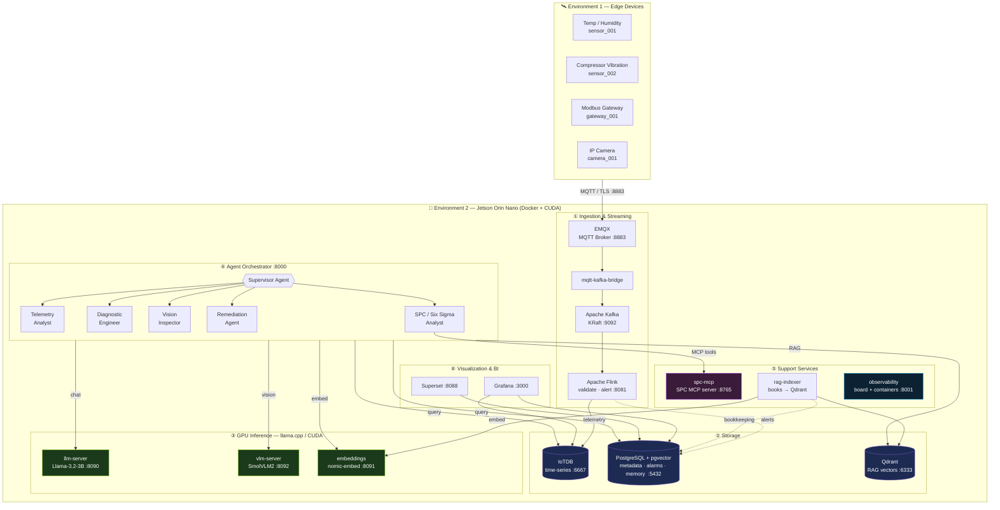
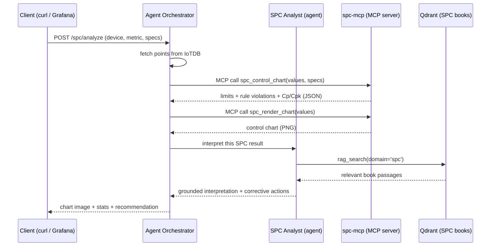

# AI/IoT Platform

> **Codename:** `X-8G2T` · An agentic, edge-native AI platform for industrial IoT —
> ingestion, streaming, storage, a multi-agent AI brain, Retrieval-Augmented
> Generation (RAG), and a dedicated **Statistical Process Control (SPC) / Six
> Sigma** expert — all running on a single **NVIDIA Jetson Orin Nano**.

[](https://opensource.org/licenses/MIT)
[](https://www.nvidia.com/en-us/autonomous-machines/embedded-systems/jetson-orin/)
[](https://www.docker.com/)
[](https://developer.nvidia.com/cuda-zone)
[](https://modelcontextprotocol.io/)

---

## 📋 Table of Contents

1. [What Is This Project?](#1-what-is-this-project)
2. [Hardware Specifications](#2-hardware-specifications)
3. [The Two Environments](#3-the-two-environments)
4. [Architecture Overview](#4-architecture-overview)
5. [System Components in Detail](#5-system-components-in-detail)
6. [The Agentic AI Subsystem](#6-the-agentic-ai-subsystem)
7. [The RAG Subsystem — Where the Book Knowledge Lives](#7-the-rag-subsystem--where-the-book-knowledge-lives)
8. [Model Context Protocol (MCP) Explained](#8-model-context-protocol-mcp-explained)
9. [The SPC / Six Sigma Specialist](#9-the-spc--six-sigma-specialist)
10. [Where Every Piece of Data Is Stored](#10-where-every-piece-of-data-is-stored)
11. [End-to-End Data Flow](#11-end-to-end-data-flow)
12. [Getting Started on the Jetson](#12-getting-started-on-the-jetson)
13. [Services & Ports Reference](#13-services--ports-reference)
    - [13a. Observability API — Board & Container Metrics](#13a-observability-api--board--container-metrics)
14. [AI Models](#14-ai-models)
15. [API Reference](#15-api-reference)
16. [Configuration (.env)](#16-configuration-env)
17. [Security](#17-security)
18. [Troubleshooting](#18-troubleshooting)
19. [Repository Layout](#19-repository-layout)
20. [Contributing & License](#20-contributing--license)

---

## 1. What Is This Project?

**AI/IoT Platform** is a complete, self-contained "edge-to-insight" system. Field
devices (sensors, gateways, cameras) stream telemetry to a single **NVIDIA Jetson
Orin Nano**, where the data is buffered, processed, stored, visualized and —
crucially — **reasoned about by a team of local AI agents** that run on the
Jetson's GPU. Nothing leaves the box: inference, retrieval and decision-making
all happen at the edge.

What makes it more than a classic IoT pipeline:

- **A multi-agent "brain."** A *Supervisor* agent decomposes a question and
  delegates to specialists (telemetry, SPC/Six Sigma, diagnostics, vision,
  remediation). Each specialist has a small set of **tools** and produces a fully
  **auditable** chain of reasoning.
- **RAG (Retrieval-Augmented Generation).** Device manuals, runbooks and a set of
  **Statistical Process Control textbooks** are embedded into a vector database.
  Agents retrieve the right passages before answering, so recommendations are
  grounded in *your* documentation, not the model's guesses.
- **A real SPC / Six Sigma expert powered by a local MCP server.** A dedicated
  **Model Context Protocol (MCP)** server computes control charts, runs Nelson /
  Western-Electric rules and Cp/Cpk capability studies, and renders the charts.
  The statistics are deterministic (no hallucinated numbers); the LLM only
  interprets and recommends.
- **GPU-native and offline.** Three OpenAI-compatible `llama.cpp` servers run the
  reasoning LLM, a vision-language model, and the embedding model fully on the
  Ampere GPU. **CUDA is already installed** on the JetPack host image; we only
  compile against it.
- **100% containerized.** One `docker compose` stack defines the entire Jetson
  environment (16 services).

> **Why "fine-tuned" without weight training?** On an 8 GB edge device, training
> model weights is impractical and brittle. This platform specializes the SPC
> agent the robust way: **RAG over the books + an expert persona + deterministic
> SPC tools exposed over MCP.** The result behaves like a domain expert and is
> easy to update — just drop a new PDF in `books/` and re-index.

---

## 2. Hardware Specifications

This platform is specifically optimized for the **NVIDIA Jetson Orin Nano Developer Kit**:

| Component | Specification |
|-----------|---------------|
| **Module** | NVIDIA Jetson Orin Nano 8GB |
| **GPU** | 1024-core NVIDIA Ampere architecture GPU with 32 Tensor Cores |
| **CPU** | 6-core Arm® Cortex-A78AE v8.2 64-bit |
| **Memory** | 8GB 128-bit LPDDR5 |
| **Storage** | 2TB NVMe SSD (M.2 Key M) |
| **Networking** | Gigabit Ethernet, 802.11ac WLAN, Bluetooth 5.0 |
| **I/O** | 4x USB 3.2 Gen2 Type A, DisplayPort, USB Type-C |
| **Expansion** | 40-pin GPIO header, 2x MIPI CSI-2 camera connectors, M.2 Key M/E |

> **Note**: While optimized for the Orin Nano, this platform can run on any ARM64 or x86_64 system with Docker support.

---

## 3. The Two Environments

The whole system has **exactly two environments**. Keep this model in mind:

| # | Environment | What runs there | Connection |
|---|-------------|-----------------|------------|
| **1** | **Edge Devices** | Sensors, gateways and IP cameras producing telemetry & images. | Publish to the Jetson over **MQTT/TLS (port 8883)**. |
| **2** | **Jetson Orin Nano Board** | *Everything else* — ingestion, streaming, storage, vector DB, GPU inference, the agent brain, the SPC MCP server, and the dashboards — all as Docker containers. | Receives device data; serves dashboards & APIs. |

Environment 1 only needs the MQTT topic convention and the TLS certificates.
Everything in Environment 2 is described by [`docker-compose.yml`](docker-compose.yml).
A device simulator ([`scripts/simulate-device.py`](scripts/simulate-device.py))
lets you act as Environment 1 from any machine.

---

## 4. Architecture Overview



<details>
<summary>📐 ASCII fallback diagram</summary>

```
┌─────────────────────────────────────────────────────────────────────────────┐
│  ENVIRONMENT 1 — EDGE DEVICES                                               │
│  [Temp/Humidity sensor_001] [Vibration sensor_002]                          │
│  [Modbus Gateway gateway_001] [IP Camera camera_001]                        │
└──────────────────────────┬──────────────────────────────────────────────────┘
                            │  MQTT / TLS  :8883   topic: telemetry/#
                            ▼
┌─────────────────────────────────────────────────────────────────────────────┐
│  ENVIRONMENT 2 — JETSON ORIN NANO  (all services run as Docker containers)  │
│                                                                             │
│  ① INGESTION & STREAMING                                                    │
│     EMQX :8883/:18083  ─►  mqtt-kafka-bridge  ─►  Kafka KRaft :9092        │
│                                               ─►  Flink validate/alert :8081│
│                                                                             │
│  ② STORAGE                                                                  │
│     IoTDB :6667/:18080   — time-series telemetry (TTL 30d/1y)               │
│     PostgreSQL :5432     — metadata, alarms, agent runs/memory (pgvector)   │
│     Qdrant :6333         — RAG vectors: device manuals + SPC books          │
│                                                                             │
│  ③ GPU INFERENCE  (llama.cpp / CUDA — Ampere sm_87)                         │
│     llm-server :8090  (Llama-3.2-3B)   vlm-server :8092  (SmolVLM2)        │
│     embeddings :8091  (nomic-embed 768d)                                    │
│                                                                             │
│  ④ AGENT ORCHESTRATOR  :8000  (FastAPI)                                     │
│     Supervisor ─► Telemetry Analyst    ─► query IoTDB / PG                  │
│                ─► SPC / Six Sigma      ─► MCP tools ─► spc-mcp :8765       │
│                ─► Diagnostic Engineer  ─► RAG retrieve ─► Qdrant            │
│                ─► Vision Inspector     ─► SmolVLM2                          │
│                ─► Remediation Agent    ─► create alarm / save memory        │
│                                                                             │
│  ⑤ SUPPORT SERVICES                                                         │
│     spc-mcp :8765      — deterministic SPC/Six Sigma MCP server             │
│     rag-indexer        — books/*.pdf + knowledge-base/ ─► embeddings ─► QD  │
│     observability :8001— Jetson board + all containers, 1-second WebSocket  │
│                                                                             │
│  ⑥ VISUALIZATION & BI                                                       │
│     Grafana :3000  (IoTDB + PostgreSQL)   Superset :8088  (PostgreSQL)      │
└─────────────────────────────────────────────────────────────────────────────┘
```
</details>

---

## 5. System Components in Detail

Each container has one job. Here is what every part does, how it works, and what
it persists.

### 4.1 EMQX — MQTT broker (the front door)
- **Role:** the single secure entry point for Environment 1. Devices publish JSON
  telemetry to `telemetry/<external_id>` over **MQTT/TLS on 8883**.
- **How it works:** terminates TLS using the certificates in [`ssl/`](ssl), checks
  client certs (`verify_peer`), and exposes a management dashboard on `18083`.
- **Config:** [`emqx/README.md`](emqx/README.md). Ports: 1883 (plain/dev), 8883
  (TLS), 8083/8084 (WebSocket), 18083 (dashboard).
- **Persists:** broker state in the `emqx_data` volume.

### 4.2 mqtt-kafka-bridge — MQTT → Kafka feeder
- **Role:** open-source EMQX has no built-in Kafka sink, so this tiny Python
  service subscribes to `telemetry/#` and republishes **normalised per-metric
  records** `{device_id, metric, value, ts}` onto Kafka.
- **Code:** [`services/mqtt-kafka-bridge/bridge.py`](services/mqtt-kafka-bridge/bridge.py).
- **Persists:** nothing (stateless relay).

### 4.3 Apache Kafka — durable buffer
- **Role:** decouples ingestion from processing and gives the pipeline a durable,
  replayable backbone. Runs in **KRaft mode** (no Zookeeper).
- **Topics:** `raw-telemetry` (from the bridge), `processed-telemetry` and
  `alerts` (from Flink).
- **Persists:** message logs in the `kafka_data` volume. Port 9092.

### 4.4 Apache Flink — real-time stream processing
- **Role:** validates and enriches the stream, and raises **threshold alerts** in
  real time. A `jobmanager` + `taskmanager` pair runs the PyFlink job.
- **Job:** [`flink/jobs/telemetry_processor.py`](flink/jobs/telemetry_processor.py)
  reads `raw-telemetry`, writes clean readings to `processed-telemetry` and rule
  breaches to `alerts`.
- **UI:** Flink dashboard on `8081`.

### 4.5 Apache IoTDB — time-series database
- **Role:** stores high-frequency telemetry efficiently. Path layout:
  `root.iot.telemetry.<external_id>.<metric>`.
- **Access:** the agent tools query it through its **REST API on 18080**; RPC on
  6667. Retention (TTL): 30 days raw, 1 year aggregated
  ([`iotdb/conf/schema.sql`](iotdb/conf/schema.sql)).
- **Persists:** `iotdb_data` volume.

### 4.6 PostgreSQL + pgvector — relational + vector store
- **Role:** the system of record for **device metadata, alarm rules, alarms,
  users, AI inferences, agent runs/steps, agent long-term memory, and RAG
  bookkeeping**. The `pgvector` extension stores embeddings for semantic memory.
- **Schema:** [`postgres/init/01-schema.sql`](postgres/init/01-schema.sql)
  (seed data in [`02-seed.sql`](postgres/init/02-seed.sql)).
- **Key tables:** `devices`, `alarm_rules`, `alarms`, `users`, `ai_inferences`,
  `agent_runs`, `agent_steps`, `agent_memory` (vector(768)), `rag_documents`.
- **Persists:** `postgres_data` volume. Port 5432.

### 4.7 Qdrant — RAG vector database
- **Role:** stores the **embeddings of the knowledge base and the SPC books**.
  This is where the *content extracted from the statistics books actually lives*
  (as vectors + the original text in each point's payload). See
  [§6](#6-the-rag-subsystem--where-the-book-knowledge-lives).
- **Collection:** `x8g2t_knowledge` (cosine, 768-dim). Each point's payload:
  `{text, title, source_path, domain, scope, device_id, chunk_index}`.
- **Persists:** `qdrant_data` volume. REST/dashboard 6333, gRPC 6334.

### 4.8 GPU inference servers — `llm-server`, `vlm-server`, `embeddings`
- **Role:** all model compute. Three roles from **one shared `llama.cpp` image**
  ([`services/llama-cpp/`](services/llama-cpp)), each serving an
  **OpenAI-compatible API** so the orchestrator talks to them uniformly:
  - `llm-server` — the reasoning LLM (chat) used by every agent. Host port 8090.
  - `vlm-server` — the vision-language model for camera frames. Host port 8092.
  - `embeddings` — the embedding model for RAG ingest + retrieval. Host port 8091.
- **GPU:** built with `GGML_CUDA` for the Orin Nano (compute capability 8.7);
  full layer offload (`-ngl 999`). Models live in the shared `models` volume.

### 4.9 Agent Orchestrator — the brain (FastAPI)
- **Role:** hosts the **multi-agent system**, the **RAG pipeline**, and the
  **MCP client**. It runs *no* models itself — it calls the GPU servers and the
  SPC MCP over HTTP — so it stays light and restartable.
- **Code:** [`services/agent-orchestrator/app/`](services/agent-orchestrator/app)
  (`core/`, `rag/`, `tools/`, `agents/`). Port 8000, docs at `/docs`.
- **Details:** [§6](#6-the-agentic-ai-subsystem).

### 4.10 spc-mcp — the local SPC / Six Sigma MCP server
- **Role:** a standalone **Model Context Protocol server** exposing deterministic
  SPC tools (control charts, special-cause rules, capability, chart rendering).
  The SPC agent calls it as tools. **GPU-free, stateless.**
- **Code:** [`services/spc-mcp/`](services/spc-mcp) — engine
  [`spc_core.py`](services/spc-mcp/spc_core.py), renderer
  [`charts.py`](services/spc-mcp/charts.py), server
  [`server.py`](services/spc-mcp/server.py). Port 8765 (streamable HTTP at `/mcp`).
- **Details:** [§8](#8-model-context-protocol-mcp-explained) and
  [§9](#9-the-spc--six-sigma-specialist).

### 4.11 rag-indexer — knowledge ingestion job
- **Role:** a one-shot/recurring job that reads the knowledge base and the SPC
  **PDF books**, chunks them, embeds them on the GPU, and upserts the vectors into
  Qdrant; it records bookkeeping in PostgreSQL so re-runs are idempotent.
- **Code:** [`services/rag-indexer/indexer.py`](services/rag-indexer/indexer.py).
- **Details:** [§7](#7-the-rag-subsystem--where-the-book-knowledge-lives).

### 4.12 Grafana — operational dashboards
- **Role:** real-time operational views (telemetry, alarms, agent runs). Ships a
  provisioned datasource + dashboard
  ([`grafana/`](grafana)). Port 3000.

### 4.13 Apache Superset — BI / analytics
- **Role:** ad-hoc business intelligence over PostgreSQL (self-initialising image,
  [`superset/`](superset)). Port 8088.

---

## 6. The Agentic AI Subsystem

The "brain" is the [`agent-orchestrator`](services/agent-orchestrator). It
implements a lightweight, dependency-free **ReAct loop** (no LangChain) so it runs
reliably on ARM/Jetson.

### Agents (least-privilege roles)

| Agent | Mission | Tools |
|-------|---------|-------|
| **Supervisor** | Decomposes the objective, delegates to specialists, synthesises the answer. | `ask_*` delegation tools |
| **Telemetry Analyst** | Quantitative time-series inspection & anomaly detection. | `query_telemetry`, `detect_anomaly`, `get_device`, `rag_search` |
| **SPC / Six Sigma Analyst** | Treats the signal as a *process*: chart selection, control limits, special-cause rules, Cp/Cpk — grounded in the books. | SPC MCP tools, `query_telemetry`, `rag_search(domain='spc')`, `save_memory` |
| **Diagnostic Engineer** | Root-cause analysis grounded in manuals/runbooks/past incidents. | `rag_search`, `recall_memory`, `get_recent_alarms`, `get_device` |
| **Vision Inspector** | Interprets camera-frame findings from the VLM. | `rag_search`, `get_device`, `get_recent_alarms` |
| **Remediation Agent** | Raises alarms and records durable insights. | `create_alarm`, `save_memory`, `recall_memory`, `get_device` |

### The tool registry

Tools live in [`app/tools/registry.py`](services/agent-orchestrator/app/tools/registry.py):
`rag_search`, `get_device`, `get_recent_alarms`, `query_telemetry`,
`detect_anomaly`, `create_alarm`, `recall_memory`, `save_memory` — plus the SPC
tools (bridged from MCP, [§8](#8-model-context-protocol-mcp-explained)) and the
`ask_*` delegation tools the supervisor uses.

### How a run works (ReAct)

```
objective ─► Supervisor
   │  think → ask_spc_analyst("run an SPC study on sensor_001 temperature")
   │            └─► SPC Analyst: query_telemetry → spc_control_chart →
   │                              rag_search(domain='spc') → answer
   │  think → ask_remediation_agent("raise critical alarm; save insight")
   │            └─► Remediation Agent: create_alarm → save_memory → answer
   └─ synthesise → final_answer  (+ full step trace persisted to PostgreSQL)
```

Every step (thought / tool call / observation) is written to `agent_steps` and
returned in the API response, so every recommendation is fully traceable. Runs
are recorded in `agent_runs`.

---

## 7. The RAG Subsystem — Where the Book Knowledge Lives

This section answers the question directly: **the information extracted from the
statistics books is stored as vector embeddings in Qdrant, with the original text
kept in each vector's payload; the indexing ledger is kept in PostgreSQL.** The
SPC MCP server stores *none* of the book text — it is pure computation.

### Ingestion pipeline (what happens to the books)

```
books/*.pdf ─► rag-indexer ─► (1) extract text (pypdf)
                              (2) chunk (≈900 chars, 150 overlap)
                              (3) embed each chunk on the GPU embeddings server (768-dim)
                              (4) upsert vectors into Qdrant collection "x8g2t_knowledge"
                              (5) record file sha256 + chunk_count in PostgreSQL rag_documents
```

- **Where the meaning is stored:** **Qdrant** (`qdrant_data` volume), collection
  `x8g2t_knowledge`. Each chunk becomes one point: the **vector** (the embedding)
  plus a **payload** that contains the **original chunk text**, the `title`,
  `source_path`, `chunk_index`, and a **`domain`** tag.
- **Domain tagging (so the SPC agent reads the right shelf):**
  - files under [`books/`](books) → `domain = "spc"`
  - files under [`knowledge-base/`](knowledge-base) → `domain = "ops"`
  The SPC agent retrieves with `rag_search(domain='spc')`, restricting results to
  the SPC literature.
- **Idempotent indexing ledger:** **PostgreSQL** table `rag_documents` stores each
  file's `source_path`, `title`, `sha256` and `chunk_count`. Re-running
  `make index` only re-embeds files whose content changed.
- **Scanned PDFs:** if a PDF has no text layer, extraction yields nothing and the
  indexer logs a warning and skips it (OCR would be needed — a future addition).

### Retrieval (how knowledge reaches the model)

```
agent question ─► embeddings server (GPU) ─► query vector
              ─► Qdrant cosine search (optionally filtered by domain/device)
              ─► top-k chunks ─► formatted with citations ─► LLM prompt
```

Retrieval code: [`app/rag/retriever.py`](services/agent-orchestrator/app/rag/retriever.py)
and [`app/rag/vectorstore.py`](services/agent-orchestrator/app/rag/vectorstore.py).

### Long-term agent memory (a second, separate store)

Distinct from the books: when an agent discovers a reusable insight it calls
`save_memory`, which embeds the insight and stores it in **PostgreSQL
`agent_memory`** (a `vector(768)` column with an IVFFlat cosine index).
`recall_memory` later does a semantic search there. This is the system's
*experience*, accumulated across runs.

| What | Stored where | Form |
|------|--------------|------|
| SPC book content | **Qdrant** `x8g2t_knowledge` (domain=spc) | embedding + original text in payload |
| Device manuals / runbooks | **Qdrant** `x8g2t_knowledge` (domain=ops) | embedding + text |
| Which files are indexed | **PostgreSQL** `rag_documents` | sha256, chunk_count |
| Agent's learned insights | **PostgreSQL** `agent_memory` | embedding + text (pgvector) |

---

## 8. Model Context Protocol (MCP) Explained

### What MCP is
The **Model Context Protocol** is an open standard for connecting AI applications
to external **tools, data and capabilities** through a uniform interface. An *MCP
server* advertises a set of tools (name + JSON-schema + description); an *MCP
client* lists those tools and calls them. It is the same idea as "function
calling," but standardized and transport-agnostic, so any MCP-capable client
(this platform, Claude Desktop, IDEs, etc.) can reuse the same server.

### Why this platform uses a local MCP server
We deliberately keep the **statistics out of the LLM**. Language models are good
at *interpreting* results but unreliable at *computing* control limits or Cp/Cpk
(they hallucinate numbers). So the deterministic SPC maths live in a dedicated
**local MCP server** (`spc-mcp`), and the agent calls it as tools. Benefits:

- **Correctness:** control limits, rules and capability are computed by tested
  Python (numpy/scipy), not guessed by the model.
- **Separation of concerns:** the math engine is independently testable
  ([`test_spc.py`](services/spc-mcp/test_spc.py)) and reusable by other MCP clients.
- **Local & private:** the MCP server runs on the Jetson; nothing leaves the box.

### The SPC MCP server in detail
- **Implementation:** `FastMCP` over the **streamable-HTTP** transport, listening
  on `spc-mcp:8765` at path `/mcp`
  ([`services/spc-mcp/server.py`](services/spc-mcp/server.py)).
- **Engine:** [`spc_core.py`](services/spc-mcp/spc_core.py) — control-chart maths,
  Nelson's 8 rules (incl. the Western-Electric subset), Cp/Cpk/Pp/Ppk/DPMO/sigma.
- **Renderer:** [`charts.py`](services/spc-mcp/charts.py) — matplotlib control
  charts (σ-zones + flagged points) as PNG/SVG.
- **Tools exposed:**

  | MCP tool | Purpose |
  |----------|---------|
  | `spc_recommend_chart` | Pick the correct chart (variable vs attribute, subgroup size) |
  | `spc_control_chart` | I-MR / Xbar-R / Xbar-S limits, points, rule violations, capability |
  | `spc_rule_check` | Run Nelson + Western-Electric special-cause rules |
  | `spc_capability` | Cp, Cpk, Pp, Ppk, DPMO, yield, sigma level (1.5σ shift) |
  | `spc_attribute_chart` | p / np / c / u charts |
  | `spc_render_chart` | Render the control chart as a PNG/SVG image |

### How the orchestrator connects (MCP client)
- [`app/core/mcp_client.py`](services/agent-orchestrator/app/core/mcp_client.py)
  opens a **fresh MCP session per call** (stateless and resilient to the server
  restarting), lists tools, calls them, and extracts text/image content.
- [`app/tools/spc_tools.py`](services/agent-orchestrator/app/tools/spc_tools.py)
  bridges the MCP tools into the agent's tool registry, so the SPC agent uses them
  through the same ReAct loop as every native tool.
- Verify the live connection at runtime: `GET /spc/mcp/tools`.



---

## 9. The SPC / Six Sigma Specialist

This is the "fine-tuned" process-control expert. Specialization comes from three
layers working together:

1. **Reads the books (RAG).** The PDFs in [`books/`](books) (Oakland's
   *Statistical Process Control*, *The Book of SPC*, *machine-health*, …) are
   embedded under the **`spc` domain** in Qdrant. The agent grounds its reasoning
   with `rag_search(domain='spc')`.
2. **Expert persona.** The `spc_analyst` agent
   ([definitions.py](services/agent-orchestrator/app/agents/definitions.py)) is
   prompted as a *Master Black Belt* with an explicit procedure: chart selection
   → stability (common vs special cause; avoid over-control) → capability →
   grounded corrective actions.
3. **Deterministic tools via the local MCP** (see [§8](#8-model-context-protocol-mcp-explained)).

### Real-time analysis → chart

- **`POST /spc/analyze`** pulls the latest points for a device/metric from IoTDB
  (or accepts an explicit `values` array), computes the chart + capability via the
  MCP, renders the chart, and returns the SPC agent's book-grounded interpretation.
- **`GET /spc/report`** returns a browser-ready **HTML page** with the rendered
  control chart, the capability table, the special-cause signals, and the agent's
  recommendation — the *solution displayed on the chart*.

### Run the SPC engine tests

```bash
make spc-test          # docker compose run --rm --entrypoint python spc-mcp test_spc.py
```

---

## 10. Where Every Piece of Data Is Stored

| Data | Service | Docker volume | Notes |
|------|---------|---------------|-------|
| Raw & aggregated telemetry | IoTDB | `iotdb_data` | `root.iot.telemetry.<id>.<metric>` |
| Device metadata, alarms, users | PostgreSQL | `postgres_data` | relational tables |
| Agent runs, steps, **memory** | PostgreSQL | `postgres_data` | `agent_runs`, `agent_steps`, `agent_memory` (pgvector) |
| RAG indexing ledger | PostgreSQL | `postgres_data` | `rag_documents` (sha256, chunk_count) |
| **SPC book & manual knowledge** | **Qdrant** | `qdrant_data` | collection `x8g2t_knowledge`, vectors + original text |
| Kafka topics | Kafka | `kafka_data` | `raw/processed-telemetry`, `alerts` |
| GGUF model weights | (shared) | `models` | downloaded by `make models` |
| Dashboards | Grafana | `grafana_data` | provisioned + user dashboards |
| Superset metadata | Superset | `superset_data` | charts, BI dashboards |
| TLS certificates | host bind | `ssl/` | generated by `make certs` |

---

## 11. End-to-End Data Flow

1. **Device → EMQX** — a device publishes JSON to `telemetry/<external_id>` over
   MQTT/TLS.
2. **EMQX → Kafka** — `mqtt-kafka-bridge` flattens each payload into per-metric
   records on `raw-telemetry`.
3. **Kafka → Flink** — validates readings, writes `processed-telemetry`, raises
   threshold `alerts`.
4. **Flink → Storage** — clean readings to **IoTDB**; alarms to **PostgreSQL**.
5. **Agents (on demand or alarm-triggered)** — the Supervisor delegates to
   specialists that query IoTDB/PostgreSQL, run anomaly detection, **retrieve
   knowledge from Qdrant**, reason on the GPU LLM, run **SPC via the local MCP**,
   optionally analyse camera frames on the VLM, and may raise alarms / save
   memories.
6. **Visualization** — **Grafana** shows telemetry, alarms and agent runs;
   **Superset** provides ad-hoc BI; `/spc/report` renders control charts.

Submit the Flink job once the cluster is up:

```bash
docker compose exec flink-jobmanager \
  flink run -py /opt/flink/usrlib/telemetry_processor.py
```

---

## 12. Getting Started on the Jetson

> You will clone this repo onto a real Jetson Orin Nano and run the full system.
> These are the exact steps.

### Prerequisites (already true on a flashed JetPack 6.x board)
- **CUDA already installed** — verify with `nvcc --version`.
- Docker + the **NVIDIA Container Toolkit** set as the default runtime:
  ```bash
  sudo apt-get install -y nvidia-container-toolkit docker-compose-plugin
  sudo nvidia-ctk runtime configure --runtime=docker
  sudo systemctl restart docker
  # confirm GPU is visible inside containers:
  docker run --rm --runtime=nvidia --gpus all nvcr.io/nvidia/l4t-base:r36.2.0 nvidia-smi
  ```
- An **NVMe SSD** is strongly recommended (models + databases). ~10 GB free for
  images + ~4 GB for models.

### The four commands

```bash
git clone https://github.com/igoralves1/x-8G2T.git
cd x-8G2T

make bootstrap   # 1) create .env from template + generate TLS certificates
                 #    -> then edit .env and replace every <CHANGE_ME> value
make models      # 2) download the GGUF models into the shared docker volume (~4 GB, one-time)
make up          # 3) build images and start the full stack (16 services)
make index       # 4) build the RAG knowledge base (knowledge-base/ + books/*.pdf) in Qdrant
```

> **Note:** `make up` compiles `llama.cpp` with CUDA on the first run — expect a
> longer initial build. The image is built **once** and reused by `llm-server`,
> `vlm-server` and `embeddings`. After `make up`, edit `.env` *before* the first
> run if you skipped it during `bootstrap`.

### Verify it's working

```bash
make ps                                   # all services healthy?
curl -s localhost:8000/health | jq        # GPU servers up, qdrant_vectors > 0, spc_mcp_tools > 0
curl -s localhost:8000/spc/mcp/tools | jq # the local SPC MCP tools are listed

# Simulate an edge device (Environment 1)
python3 scripts/simulate-device.py --host localhost --device sensor_001 \
    --metric temperature --base 5 --spike-prob 0.2

# Ask the agents to investigate (Environment 2)
curl -s -X POST localhost:8000/agent/investigate \
  -H "Authorization: Bearer $AI_API_KEY" -H "Content-Type: application/json" \
  -d '{"objective":"Is sensor_001 healthy? Find the cause and act.","device_id":"sensor_001"}' | jq

# Run a Statistical Process Control study and open the chart report in a browser
curl -s -X POST localhost:8000/spc/analyze \
  -H "Authorization: Bearer $AI_API_KEY" -H "Content-Type: application/json" \
  -d '{"device_id":"sensor_001","metric":"temperature","usl":8,"lsl":2,"target":4}' | jq
#   http://<jetson-ip>:8000/spc/report?device_id=sensor_001&metric=temperature&usl=8&lsl=2
```

### Useful `make` targets

| Target | What it does |
|--------|--------------|
| `make bootstrap` | create `.env` + generate TLS certs |
| `make models` | download GGUF models into the `models` volume |
| `make up` | build + start the full stack (`--profile all`) |
| `make core` | start only the core pipeline (no Superset/VLM) |
| `make index` | (re)build the RAG knowledge base incl. the SPC books |
| `make spc-test` | run the SPC engine test suite |
| `make ps` / `make logs S=<svc>` | status / tail logs |
| `make down` / `make clean` | stop / stop and delete all volumes |

### Profiles

| Profile | Services |
|---------|----------|
| `core` | EMQX, bridge, Kafka, Flink, IoTDB, Postgres, Qdrant, `llm-server`, `embeddings`, `spc-mcp`, agent-orchestrator, Grafana |
| `ai` | adds `vlm-server`, `rag-indexer` |
| `bi` | Superset |
| `all` | everything (16 services) |
| `index` | runs only the `rag-indexer` job |

---

## 13. Services & Ports Reference

| Service | Image / build | Host port | GPU | Role |
|---------|---------------|-----------|-----|------|
| `emqx` | emqx/emqx:5.8.4 | 8883, 18083 | – | MQTT/TLS broker + dashboard |
| `mqtt-kafka-bridge` | build | – | – | EMQX → Kafka feeder |
| `kafka` | apache/kafka:3.7.1 | 9092 | – | KRaft buffer |
| `flink-jobmanager` | build (1.18) | 8081 | – | PyFlink + Kafka connector |
| `flink-taskmanager` | build (1.18) | – | – | task slots |
| `iotdb` | apache/iotdb:1.3.2 | 6667, 18080 | – | time-series; REST used by agents |
| `postgres` | build (16 + pgvector) | 5432 | – | metadata, alarms, agent memory, RAG ledger |
| `qdrant` | qdrant:v1.11.3 | 6333, 6334 | – | RAG vectors (manuals + SPC books) |
| `llm-server` | build (llama.cpp) | 8090→8080 | ✅ | reasoning LLM |
| `vlm-server` | build (llama.cpp) | 8092→8080 | ✅ | vision-language model |
| `embeddings` | build (llama.cpp) | 8091→8080 | ✅ | RAG embeddings |
| `spc-mcp` | build (FastMCP) | 8765 | – | local SPC / Six Sigma MCP server |
| `agent-orchestrator` | build (FastAPI) | 8000 | – | multi-agent brain + RAG + MCP client |
| `rag-indexer` | build | – | – | knowledge + books → Qdrant |
| `observability` | build (FastAPI) | 8001 | – | board + container hardware metrics API |
| `grafana` | grafana:11.1.0 | 3000 | – | dashboards |
| `superset` | build (4.0) | 8088 | – | BI |

**Web UIs:** Grafana `:3000` · EMQX `:18083` · Flink `:8081` · Qdrant
`:6333/dashboard` · Superset `:8088` · Agent API docs `:8000/docs` · Observability
API docs `:8001/docs`.

---

## 13a. Observability API — Board & Container Metrics

The `observability` container (port **8001**) exposes a complete real-time view of
the Jetson Orin Nano hardware and every Docker container, updated **every 1 second**.
It is the data source for the admin dashboard at
`http://<jetson-ip>:5173/sm-dashboard-client/admin/x-8g2t`.

### Transport

| Endpoint | Protocol | Description |
|---|---|---|
| `GET /health` | REST | Liveness probe; includes connected WebSocket client count and tegrastats status |
| `GET /api/metrics` | REST | Full snapshot (board + all containers) |
| `GET /api/board` | REST | Board metrics only |
| `GET /api/containers` | REST | All containers (stats, no logs) |
| `GET /api/containers/{name}/logs` | REST | Last N log lines for a named container |
| `WS /ws` | WebSocket | Streams a full snapshot every 1 second to every connected client |

Connect the frontend with:
```js
const ws = new WebSocket('ws://10.0.0.11:8001/ws')
ws.onmessage = e => { const data = JSON.parse(e.data) /* board + containers */ }
```

### Board metrics — what is collected every second

#### CPU  (`board.cpu`)

| Field | Source | Detail |
|---|---|---|
| `util_percent` | psutil | Overall CPU utilisation % |
| `util_per_core[]` | psutil | Per-core utilisation % (6 cores) |
| `count_logical / physical` | psutil | 6 logical / 6 physical (Cortex-A78AE) |
| `freq_mhz` | psutil | Weighted average current frequency |
| `freq_max_mhz` | psutil | Max allowed frequency (1344 MHz) |
| `load_avg[1m, 5m, 15m]` | psutil | System load averages |
| `cores[].freq_mhz` | `/sys/devices/system/cpu/cpu*/cpufreq/scaling_cur_freq` | Per-core current frequency in MHz |
| `cores[].freq_max/min_mhz` | sysfs | Per-core frequency bounds |
| `cores[].governor` | sysfs | Per-core governor (`schedutil`) |
| `cores[].util_percent` | tegrastats | Per-core live utilisation % from `CPU [util%@freq,…]` |

#### GPU  (`board.gpu`)  — Ampere, 1024 CUDA cores, 32 Tensor cores

| Field | Source | Detail |
|---|---|---|
| `util_percent` | tegrastats `GR3D_FREQ` | GPU engine utilisation % (0–100) |
| `freq_mhz` | `/sys/class/devfreq/17000000.gpu/cur_freq` | Current GPU clock in MHz |
| `freq_max_mhz` | sysfs | Max GPU clock (918 MHz) |
| `freq_min_mhz` | sysfs | Min GPU clock (306 MHz) |
| `governor` | sysfs | Clock governor (`nvhost_podgov`) |
| `available_freqs[]` | sysfs | 8 discrete steps: 306 / 408 / 510 / 612 / 714 / 816 / 918 / 1020 MHz |
| `emc_util_percent` | tegrastats `EMC_FREQ` | External Memory Controller utilisation % |
| `emc_freq_mhz` | tegrastats | EMC clock (2133 MHz nominal) |
| `vic_util_percent` | tegrastats `VIC_FREQ` | Video Image Compositor utilisation % |

> **GPU memory note:** the Jetson Orin Nano uses **unified memory** — the CPU and GPU
> share the same physical LPDDR5 pool. There is no separate VRAM. GPU allocations
> come from the same 8 GB seen by the OS. The `memory.tegra_lfb_*` fields report
> the largest contiguous free block count and size, which indicates how fragmented
> the unified pool is — low `lfb` values under GPU load are normal.

#### Memory  (`board.memory`)  — unified CPU + GPU pool

| Field | Source | Detail |
|---|---|---|
| `total` | psutil | Total physical RAM (7,989,755,904 bytes ≈ 8 GB LPDDR5) |
| `used` | psutil | OS-level used (total − available) |
| `available` | psutil | Memory available to new processes |
| `percent` | psutil | Used % |
| `buffers / cached` | psutil | Kernel buffers and page cache |
| `tegra_used_mb` | tegrastats `RAM` | Tegra-reported used MB (includes GPU allocations) |
| `tegra_total_mb` | tegrastats | Tegra-reported total MB (≈ 7620 MB usable) |
| `tegra_lfb_blocks` | tegrastats `lfb NxMB` | Number of largest-free-block chunks |
| `tegra_lfb_mb` | tegrastats | Size of each largest-free-block chunk in MB |

#### Swap  (`board.swap`)  — zram

| Field | Detail |
|---|---|
| `total / used / free` | zram swap pool (≈ 4 GB — 6 × zram devices) |
| `percent` | Used % |

#### Disk  (`board.disk`)

Three physical devices are tracked independently:

| Key | Device | Type | Capacity | Noted detail |
|---|---|---|---|---|
| `emmc` | `/dev/mmcblk0` | eMMC | 476 GB | System drive; `/` mounted on `mmcblk0p1` (9.7% used) |
| `nvme0` | `/dev/nvme0n1` | NVMe | 1 TB | Samsung SSD 990 EVO Plus 1TB |
| `nvme1` | `/dev/nvme1n1` | NVMe | 1 TB | Kingston SNV3S M.2 1TB |

Each entry includes:

| Field | Source | Detail |
|---|---|---|
| `usage.total / used / free / percent` | psutil `disk_usage` | Filesystem capacity (where mounted) |
| `io.reads_completed` | `/sys/block/*/stat` field 0 | Total read operations since boot |
| `io.sectors_read` | sysfs stat field 2 | Sectors read (× 512 = bytes) |
| `io.bytes_read` | computed | Cumulative bytes read |
| `io.writes_completed` | sysfs stat field 4 | Total write operations since boot |
| `io.bytes_written` | computed | Cumulative bytes written |
| `io.ios_in_progress` | sysfs stat field 8 | I/O operations currently in flight |
| `model` | `/sys/class/nvme/nvme*/model` | NVMe model string (NVMe only) |
| `size_gb` | `/sys/block/*/size` | Physical device capacity in GB |

#### Network  (`board.net`)

Read from `/proc/1/net/dev` (host network namespace) so all **host interfaces** are
visible, not just the container's own `eth0`.

| Interface | Role |
|---|---|
| `wlP1p1s0` | Wi-Fi (802.11ac) — primary uplink |
| `enP8p1s0` | Gigabit Ethernet |
| `docker0` | Docker default bridge |
| `br-*` | Docker compose network bridge |
| `veth*` | Per-container virtual Ethernet pairs |
| `can0` | CAN bus interface |
| `usb0 / usb1` | USB gadget interfaces |
| `l4tbr0` | L4T USB device Ethernet bridge |
| `lo` | Loopback |

Each interface reports: `bytes_sent`, `bytes_recv`, `packets_sent`, `packets_recv`,
`errin`, `errout`, `dropin`, `dropout`.

#### Power  (`board.power`)  — INA3221 (hwmon1)

Three power rails are measured by the on-board **Texas Instruments INA3221**
triple-channel current/voltage monitor:

| Rail | Channel | Measures | Typical idle |
|---|---|---|---|
| `VDD_IN` | ch1 | Total board input power (5 V rail) | ~5.3 W |
| `VDD_CPU_GPU_CV` | ch2 | CPU + GPU + CV accelerator combined | ~0.6 W |
| `VDD_SOC` | ch3 | SoC logic (excluding CPU/GPU) | ~1.5 W |

Each rail reports `current_ma`, `voltage_mv`, and `power_mw` (= mA × mV / 1000).
`power.total_mw` is the sum of all three rails.

#### Temperatures  (`board.temperatures`)

| Key | Sensor | Typical idle |
|---|---|---|
| `cpu-thermal` | CPU cluster thermal zone | ~51 °C |
| `gpu-thermal` | GPU thermal zone | ~50 °C |
| `soc0-thermal` | SoC thermal zone 0 | ~50 °C |
| `soc1-thermal` | SoC thermal zone 1 | ~50 °C |
| `soc2-thermal` | SoC thermal zone 2 | ~48 °C |
| `tj-thermal` | Junction temperature (max of all zones) | ~51 °C |
| `tegrastats/cpu` · `tegrastats/gpu` · … | tegrastats cross-reference | same sensors, higher precision |

Source: `/sys/devices/virtual/thermal/thermal_zone*/temp` (millidegrees → °C).

#### Fan  (`board.fan`)

| Field | Source | Detail |
|---|---|---|
| `pwmfan/pwm1` | `/sys/class/hwmon/hwmon0/pwm1` | Fan PWM duty cycle (0–255). 76 ≈ 30% duty at idle. |

#### System

| Field | Detail |
|---|---|
| `uptime_seconds` | Seconds since last boot |
| `boot_time` | Unix timestamp of last boot |
| `tegrastats_available` | `true` if tegrastats is reachable via nsenter (GPU util active) |

### Container metrics — per running container

| Field | Source | Detail |
|---|---|---|
| `id` | Docker API | Short container ID |
| `name` | Docker API | Container name |
| `status` | Docker API | `running` / `restarting` / `exited` / … |
| `image` | Docker API | Image tag |
| `health` | Docker API | `healthy` / `unhealthy` / `starting` / `none` |
| `restart_count` | Docker API | Cumulative restart count |
| `ports` | Docker API | Port bindings map |
| `cpu_percent` | Docker stats API | CPU utilisation % (accounts for all host cores) |
| `memory_usage` | Docker stats | RSS − page cache (matches `docker stats` display) |
| `memory_limit` | Docker stats | Container memory limit (= host RAM if unlimited) |
| `memory_percent` | computed | `memory_usage / memory_limit × 100` |
| `net_rx_bytes` | Docker stats | Cumulative bytes received across all container interfaces |
| `net_tx_bytes` | Docker stats | Cumulative bytes transmitted |
| `block_read_bytes` | Docker stats blkio | Cumulative bytes read from block devices |
| `block_write_bytes` | Docker stats blkio | Cumulative bytes written to block devices |
| `logs[]` | Docker logs API | Last 30 log lines with timestamps |

### Implementation notes

- **tegrastats** is launched via `nsenter --target 1 --mount` so it runs in the
  host's mount namespace and can access all NVIDIA kernel interfaces. This requires
  `privileged: true` on the observability container.
- **sysfs reads** use raw `open()` (not Python's `pathlib.read_text()`) to avoid
  buffered-I/O failures on kernel virtual files.
- **Container stats** for all running containers are fetched **in parallel** using
  `asyncio.gather` + a `ThreadPoolExecutor` (32 workers), so the 1-second budget is
  not multiplied by the number of containers.
- **Network stats** come from `/proc/1/net/dev` (PID 1 = host init), not the
  container's own network namespace, so all host interfaces are visible.
- **Code:** [`services/observability/app/main.py`](services/observability/app/main.py)

---

## 14. AI Models

All models are **open / ungated GGUF** builds, pulled by
[`scripts/download-models.sh`](scripts/download-models.sh) (`make models`) into
the shared `models` volume. Filenames are set in `.env`.

| Role | Model | Quant | ~VRAM | `.env` key |
|------|-------|-------|-------|------------|
| Reasoning LLM | Llama-3.2-3B-Instruct | Q4_K_M | ~2.2 GB | `LLM_MODEL_FILE` |
| Vision (VLM) | SmolVLM2-2.2B-Instruct (+mmproj) | Q4_K_M | ~1.7 GB | `VLM_MODEL_FILE`, `VLM_MMPROJ_FILE` |
| Embeddings | nomic-embed-text-v1.5 (768-dim) | Q8_0 | ~0.3 GB | `EMBED_MODEL_FILE`, `EMBED_DIM` |

To change the embedding model, also update `EMBED_DIM` (it must match Qdrant and
the `agent_memory` vector column) and re-index.

---

## 15. API Reference

Base URL: `http://<jetson-ip>:8000` · Auth: `Authorization: Bearer $AI_API_KEY`
(disabled automatically if `AI_API_KEY` is empty) · Interactive docs: `/docs`.

| Method | Endpoint | Description |
|--------|----------|-------------|
| GET | `/health` | Service + GPU server health, Qdrant vector count, MCP tool count |
| POST | `/agent/investigate` | Run the multi-agent investigation on an objective |
| GET | `/agent/runs/{run_id}` | Fetch a run and its full step trace |
| POST | `/rag/search` | Direct semantic search over the knowledge base |
| POST | `/spc/analyze` | SPC study (chart + rules + Cp/Cpk) + rendered chart + agent interpretation |
| GET | `/spc/report` | HTML report: chart image + capability + recommendation |
| GET | `/spc/mcp/tools` | List the live tools from the local SPC MCP server |
| POST | `/infer/vlm` | Analyze an uploaded camera image (multipart) |
| POST | `/infer/timeseries` | Statistical anomaly detection over a value list |
| GET | `/devices` | Device health summary |
| GET | `/alarms` | Recent alarms |

<details>
<summary><code>POST /agent/investigate</code></summary>

```json
{ "objective": "Is sensor_001 healthy? If not, find the cause and act.",
  "device_id": "sensor_001", "triggered_by": "api" }
```
</details>

<details>
<summary><code>POST /spc/analyze</code></summary>

```json
{ "device_id": "sensor_001", "metric": "temperature", "limit": 100,
  "subgroup_size": 1, "usl": 8.0, "lsl": 2.0, "target": 4.0, "interpret": true }
```

Returns the SPC summary (chart type, limits, violations, capability), a
base64-encoded control-chart image, and the SPC agent's grounded interpretation.
</details>

---

## 16. Configuration (.env)

Copy [`.env.example`](.env.example) to `.env` (done by `make bootstrap`) and set
secrets. Key groups:

- **Credentials:** `POSTGRES_*`, `EMQX_*`, `IOTDB_*`, `GF_*`, `SUPERSET_*`.
- **API security:** `AI_API_KEY`, `JWT_SECRET`.
- **Models:** `LLM_MODEL_FILE`, `VLM_MODEL_FILE`, `VLM_MMPROJ_FILE`,
  `EMBED_MODEL_FILE`, `EMBED_DIM`.
- **RAG:** `RAG_COLLECTION`, `RAG_TOP_K`, `RAG_CHUNK_SIZE`, `RAG_CHUNK_OVERLAP`,
  `KB_DOMAIN`, `BOOKS_DOMAIN`.
- **Agents / MCP:** `AGENT_MAX_STEPS`, `AGENT_TEMPERATURE`, `SPC_MCP_URL`.

Generate strong secrets with `openssl rand -base64 32`. `.env` is git-ignored.

---

## 17. Security

- **Transport:** MQTT over **TLS 1.2/1.3** on 8883 with X.509 certs
  ([`ssl/generate-certs.sh`](ssl/generate-certs.sh)); mutual TLS (`verify_peer`).
- **Secrets:** everything via `.env` (git-ignored); nothing hard-coded.
- **Least privilege:** each agent gets only the tools it needs — e.g. only the
  **Remediation Agent** can `create_alarm`.
- **Auditability:** every agent thought, tool call and observation is persisted.
- **Isolation:** Docker bridge network; only necessary ports published.

> **Production hardening:** remove host-published ports for internal services
> (Postgres, Kafka, the inference servers, spc-mcp), put the web UIs behind a
> reverse proxy with HTTPS, enforce `FAIL_IF_NO_PEER_CERT=true`, and rotate the
> API key + certificates.

---

## 18. Troubleshooting

**GPU not visible in containers**
```bash
docker run --rm --runtime=nvidia --gpus all nvcr.io/nvidia/l4t-base:r36.2.0 nvidia-smi
sudo nvidia-ctk runtime configure --runtime=docker && sudo systemctl restart docker
```

**A model server is unhealthy / "model file not found"**
```bash
make models                        # ensure GGUF files are in the volume
docker compose logs -f llm-server  # watch CUDA load + offload
```

**Agent answers but cites no documents** — index the knowledge base:
```bash
make index
curl -s localhost:8000/health | jq '.components.qdrant_vectors'   # should be > 0
```

**SPC tools unavailable** — check the MCP server:
```bash
curl -s localhost:8000/spc/mcp/tools | jq
docker compose logs -f spc-mcp
```

**A book wasn't indexed** — it may be a scanned (image-only) PDF with no text
layer; the indexer logs `no extractable text` and skips it (OCR needed).

**Out of memory on the 8 GB Orin** — run the `core` profile (LLM + embeddings, no
VLM), add swap, or use a smaller quant:
```bash
docker compose --profile core up -d
```

**Flink not producing** — confirm topics and submit the job:
```bash
docker compose exec kafka /opt/kafka/bin/kafka-topics.sh --bootstrap-server localhost:9092 --list
docker compose exec flink-jobmanager flink run -py /opt/flink/usrlib/telemetry_processor.py
```

---

## 19. Repository Layout

```
x-8G2T/
├── docker-compose.yml            # the entire Environment 2 (16 services)
├── .env.example                  # copy to .env and fill in secrets
├── Makefile                      # bootstrap / models / up / index / spc-test
├── ssl/generate-certs.sh         # CA + broker + device TLS certificates
├── postgres/                     # postgres:16 + pgvector
│   ├── Dockerfile
│   └── init/                     # schema (01) + seed data (02)
├── iotdb/conf/schema.sql         # time-series path layout + TTLs
├── emqx/README.md                # topic convention, TLS, Kafka bridging
├── flink/                        # Flink 1.18 + PyFlink + Kafka connector
│   ├── Dockerfile
│   └── jobs/telemetry_processor.py
├── services/
│   ├── llama-cpp/                # ONE image, 3 roles (llm | vlm | embed), CUDA
│   ├── mqtt-kafka-bridge/        # EMQX → Kafka feeder
│   ├── spc-mcp/                  # LOCAL SPC / Six Sigma MCP server
│   │   ├── spc_core.py           #   control charts, Nelson/WE rules, Cp/Cpk
│   │   ├── charts.py             #   matplotlib chart rendering (PNG/SVG)
│   │   ├── server.py             #   FastMCP server (streamable HTTP)
│   │   └── test_spc.py           #   SPC engine tests
│   ├── agent-orchestrator/       # multi-agent brain + RAG + MCP client (FastAPI)
│   │   └── app/{core,rag,tools,agents}/
│   └── rag-indexer/              # knowledge-base + books → Qdrant
├── books/                        # SPC / Six Sigma reference PDFs (domain=spc)
├── knowledge-base/               # RAG source docs (.md, domain=ops)
├── grafana/                      # datasources + provisioned dashboard
├── superset/                     # self-initialising BI image
└── scripts/
    ├── download-models.sh        # pull GGUF models into the shared volume
    └── simulate-device.py        # Environment 1 device simulator
```

---

## 20. Contributing & License

Contributions welcome: keep everything containerized, use `.env` for all secrets,
add health checks + logging for new services, and document new API endpoints and
agent tools.

Licensed under the **MIT License** — see [LICENSE](LICENSE).

### Acknowledgments
NVIDIA (Jetson, JetPack/CUDA) · Apache Software Foundation (IoTDB, Kafka, Flink,
Superset) · EMQX · ggml-org / llama.cpp · Qdrant · pgvector · Nomic AI · the
Model Context Protocol community · and the SPC literature (Oakland and others)
that grounds the Six Sigma agent.

---

**Built with ❤️ and CUDA on the NVIDIA Jetson Orin Nano**

*Questions or issues: <https://github.com/igoralves1/x-8G2T/issues>*
