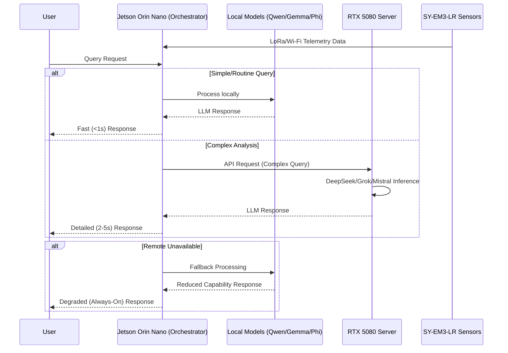

# Statistical Process Control — Knowledge Base & AI Training Plan

> **Who this document is for:** This plan is written to be understood by someone
> who is new to AI concepts. Every term is explained. Every step is described in
> detail. Nothing is assumed. Read from top to bottom the first time.

---

## Table of Contents

1. [Hardware Specifications](#1-hardware-specifications)
2. [What Resources We Have](#2-what-resources-we-have)
3. [Understanding the Key AI Concepts (Read This First)](#3-understanding-the-key-ai-concepts-read-this-first)
4. [The Goal — What We Are Building](#4-the-goal--what-we-are-building)
5. [Can the Jetson Run This? Honest Hardware Analysis](#5-can-the-jetson-run-this-honest-hardware-analysis)
6. [The Two Ways to Make the AI Smart (RAG vs Fine-Tuning)](#6-the-two-ways-to-make-the-ai-smart-rag-vs-fine-tuning)
7. [Phase 1 — Activate the RAG Knowledge Base (Do This Today)](#7-phase-1--activate-the-rag-knowledge-base-do-this-today)
8. [Phase 2 — Process the YouTube Videos into Text](#8-phase-2--process-the-youtube-videos-into-text)
9. [Phase 3 — Write the Supplementary Markdown Files](#9-phase-3--write-the-supplementary-markdown-files)
10. [Phase 4 — Build the Fine-Tuning Training Dataset](#10-phase-4--build-the-fine-tuning-training-dataset)
11. [Phase 5 — Fine-Tune the Model on the Windows PC](#11-phase-5--fine-tune-the-model-on-the-windows-pc)
12. [Phase 6 — Deploy the Trained Model to the Jetson](#12-phase-6--deploy-the-trained-model-to-the-jetson)
13. [Phase 7 — Connect the Agent to the Dashboard](#13-phase-7--connect-the-agent-to-the-dashboard)
14. [Phase 8 — The Permanent Update Loop](#14-phase-8--the-permanent-update-loop)
15. [File & Folder Structure](#15-file--folder-structure)
16. [Summary Table](#16-summary-table)

---

## 1. Hardware Specifications

| Component | Specification |
|-----------|---------------|
| **Module** | NVIDIA Jetson Orin Nano 8GB |
| **GPU** | 1024-core NVIDIA Ampere architecture GPU with 32 Tensor Cores |
| **CPU** | 6-core Arm® Cortex-A78AE v8.2 64-bit |
| **Memory** | 8GB 128-bit LPDDR5 (shared between CPU and GPU) |
| **Storage** | 2TB NVMe SSD (M.2 Key M) |
| **Networking** | Gigabit Ethernet, 802.11ac WLAN, Bluetooth 5.0 |
| **I/O** | 4x USB 3.2 Gen2 Type A, DisplayPort, USB Type-C |
| **Expansion** | 40-pin GPIO header, 2x MIPI CSI-2 camera connectors, M.2 Key M/E |

### Other machines available on the local network

| Machine | CPU | GPU | RAM | Storage | Role |
|---------|-----|-----|-----|---------|------|
| **Windows PC** | AMD Ryzen 9 9900X | RTX 5080 (16GB GDDR7) | 32GB | 2TB SSD | AI Training |
| **Mac M4** | Apple M4 | Apple GPU (16GB unified) | 16GB | 512GB SSD | Fast iteration / dataset curation |

---

## 2. What Resources We Have

### The Three Books (PDFs)

After inspecting all three PDF files in this folder:

**Book 1 — Oakland SPC, 5th Edition (Primary copy)**
- File: `Statistical-Process-Control,fifth edition,,John S. Oakland.pdf`
- Author: John S. Oakland, Professor at Leeds University Business School
- Publisher: Butterworth-Heinemann, 2003
- Size: 441 pages, 15 chapters
- ISBN: 0 7506 5766 9
- Content: The most comprehensive academic SPC reference. Covers everything from basic
  quality concepts to advanced Six Sigma, with full worked examples for every chart type.

**Book 2 — Oakland SPC, 5th Edition (Second copy — same book, different scan)**
- File: `Statistical Process Control-Joan S.Oakland-5th edition..pdf`
- This is the **identical book** as Book 1 — same ISBN, same table of contents, same
  content. The filename says "Joan" but the author is still "John S. Oakland". This is
  a typo in the filename. The cover image is different (colorful vs. plain) but the text
  is the same. We will use both in the RAG system because different scans sometimes
  extract different pages successfully — one scan may succeed where the other's text
  extraction fails.

**Book 3 — The Book of Statistical Process Control, 2nd Edition (Zontec)**
- File: `The-Book-of-SPC-Complimentary-eBook.pdf`
- Author: Zontec Inc., Cincinnati, OH
- Publisher: The Zontec Press, 2010
- Size: ~155 pages, 14 chapters
- ISBN: 978-0-9720994-1-7
- Content: A practitioner-focused guide. Less academic than Oakland, more practical.
  Chapter 8 ("Control Chart Analysis") is particularly valuable — it catalogs every
  type of pattern that can appear in a control chart and what each one means.

### The 16 YouTube Reference Videos

These videos need to be processed (transcribed/summarized) before they can be used by
the AI. See Phase 2 for how to do this.

- https://www.youtube.com/watch?v=Poa5RVUo57g
- https://www.youtube.com/watch?v=iOJDBpOa3Ko
- https://www.youtube.com/watch?v=vYHXXw-Uupo
- https://www.youtube.com/watch?v=0hJYsa4Gojw
- https://www.youtube.com/watch?v=Bh_BvCOG1NA
- https://www.youtube.com/watch?v=yuH35ottILU
- https://www.youtube.com/watch?v=jCj_HnOXMdU
- https://www.youtube.com/watch?v=doup3IZ6xdU
- https://www.youtube.com/watch?v=1dkqSlJFfLo
- https://www.youtube.com/watch?v=TBQA3anac0A
- https://www.youtube.com/watch?v=ch0MRQcZSUE
- https://www.youtube.com/watch?v=sLXJjQmfUgE
- https://www.youtube.com/watch?v=e5g2NmIUdck
- https://www.youtube.com/watch?v=DZwajTjyPmA
- https://www.youtube.com/watch?v=mLvizyDFLQ4
- https://www.youtube.com/watch?v=uPTdz8mkxi8

---

## 3. Understanding the Key AI Concepts (Read This First)

Before we plan how to train the AI, you need to understand what is actually happening
inside the machine. This section explains four concepts in plain language.

### 3.1 What is an AI Model?

An AI model (like the one running on the Jetson) is a very large mathematical function
stored in a file. When you ask it a question, numbers flow through billions of
mathematical operations and produce an answer as text.

The model we use is called **Llama-3.2-3B-Instruct**, made by Meta (Facebook's parent
company). The "3B" means it has 3 billion parameters — think of parameters as the 3
billion knobs and dials inside the math function that were tuned during its original
training on vast amounts of internet text.

The model file on our Jetson is in a format called **GGUF**, which is a compressed
(quantized) version that fits on smaller hardware. Our file is the "Q4_K_M" variant —
it uses 4-bit numbers instead of 32-bit, which reduces the file from ~12GB to ~2.2GB
while keeping most of the intelligence.

**The key thing to understand:** The base Llama model knows a lot about the world from
its original training, but it was not specifically trained to be a Statistical Process
Control expert. It knows some SPC from reading the internet, but it can make mistakes,
especially with calculations. Our job is to fix that.

### 3.2 What is RAG? (Retrieval-Augmented Generation)

Imagine the AI is a very smart student taking an open-book exam. RAG is the "open book."

Without RAG: The student answers from memory. Fast, but can make things up.

With RAG: Before answering, the student looks up the most relevant pages in the
textbook and reads them. Then answers based on what they just read. Slower but
grounded in real facts.

Here is exactly how RAG works in our system:

```
Step 1 — PREPARATION (run once, then update as needed):
  Your PDF books are broken into small text pieces called "chunks"
  (each chunk is about 900 characters — roughly one paragraph).
  Each chunk is converted into a list of ~768 numbers called an "embedding"
  (an embedding captures the MEANING of the text, not just the words).
  These embeddings are stored in a special database called Qdrant
  (which lives in a Docker container on the Jetson).

Step 2 — AT QUERY TIME (every time the agent answers a question):
  The user's question is also converted into an embedding (768 numbers).
  Qdrant searches for the chunks whose embeddings are mathematically closest
  to the question's embedding — closest means most relevant in meaning.
  The top 5-10 most relevant chunks are retrieved with their original text.
  That text is put INSIDE the prompt sent to the LLM (the AI model).
  The LLM reads those book passages first, then answers the question.
```

This means: **the AI's answers about SPC will be grounded in Oakland and Zontec's
exact words, not in the AI's (possibly wrong) memory.** When the agent says "according
to Oakland, a Cpk below 1.0 means the process is not capable," it is actually reading
that from the book text — not hallucinating it.

**RAG does NOT change the model weights.** The model file stays the same. You just
add a reference library that the model can look up. This means:
- Adding new knowledge is as easy as dropping a PDF and running `make index`.
- There is no training, no GPU, no waiting.
- Anyone can update the knowledge base just by adding files.

### 3.3 What is Fine-Tuning?

If RAG is teaching a student to use a reference book, fine-tuning is more like putting
the student through an intensive training course until the knowledge becomes instinct.

Fine-tuning changes the actual parameters (the 3 billion knobs) inside the model file.
We feed the model thousands of question-answer examples. For each example, we calculate
how wrong the model's answer was, then we adjust the knobs slightly to make it less
wrong next time. After many thousands of these adjustments, the model starts
spontaneously reasoning the way the examples teach it to.

**The specific technique we use is called LoRA** (Low-Rank Adaptation). Here's why:

Full fine-tuning would mean adjusting all 3 billion parameters, which requires
enormous amounts of GPU memory and time. LoRA is smarter — it adds a small set of
new parameters (a few million) that sit alongside the original ones and learn the
new behaviors, while the original 3 billion parameters stay frozen. The result is
nearly as good as full fine-tuning, but uses far less memory and trains much faster.

After LoRA training, we "merge" the LoRA additions into the original model and export
the result as a new GGUF file. This new file is then deployed to the Jetson. The
Jetson now runs a model that naturally reasons like an SPC expert, even without
looking anything up.

**Important:** Fine-tuning requires a lot of GPU memory during the training process.
The Jetson's 8GB is not enough for training (only inference). This is why we use the
**Windows PC with the RTX 5080 (16GB dedicated VRAM)** for training. Once training
is done, the resulting GGUF file is small enough to deploy on the Jetson.

### 3.4 What is MCP? (Model Context Protocol)

MCP is a way to give the AI model access to tools — external programs it can call
to get precise answers that pure language generation cannot guarantee.

Think of it this way: a brilliant mathematician (the LLM) is bad at arithmetic when
asked verbally, but excellent at understanding what arithmetic to do. MCP gives the
mathematician a calculator. The mathematician decides what calculation to run, the
calculator runs it with perfect precision, and the mathematician interprets the result.

In our system, `spc-mcp` is a Python program that runs as a Docker container. It
exposes these tools to the AI agent:

| MCP Tool | What it does precisely |
|----------|------------------------|
| `spc_recommend_chart` | Given variable type and subgroup size, returns the correct chart type |
| `spc_control_chart` | Computes exact UCL/LCL using proper constants (A2, D3, D4) — not estimated |
| `spc_rule_check` | Checks all 8 Nelson rules and Western-Electric rules with zero error |
| `spc_capability` | Computes Cp, Cpk, Pp, Ppk, DPMO to exact decimal places |
| `spc_attribute_chart` | Computes p, np, c, u chart limits |
| `spc_render_chart` | Draws the actual control chart as a PNG/SVG image |

The AI never calculates these numbers itself — it calls the tool, gets the exact
answer, then uses its language skills to interpret and explain the result.

**This combination is important:**
- The MCP handles the MATH (deterministic, always correct, based on NumPy/SciPy).
- RAG provides the KNOWLEDGE (from the textbooks).
- The trained model provides the REASONING (from the fine-tuning).

Together, they produce an agent that reasons like an expert, cites book sources, and
never makes arithmetic errors.

---

## 4. The Goal — What We Are Building

We are building a **self-contained SPC intelligence system** that:

1. **Lives entirely on the Jetson** — no internet required after setup.
2. **Reads real sensor data** from the IoT devices (temperature, vibration, pressure,
   etc.) via the existing Kafka/IoTDB pipeline.
3. **Analyzes the data** using proper SPC math (through the MCP server tools).
4. **Interprets the results** using knowledge extracted from the three books.
5. **Sends alerts** to the `sm-dashboard-client` frontend (the `simemap` branch) with
   severity levels: `critical`, `warning`, or `info`.
6. **Explains WHY** an alert was raised, citing the relevant book passages.
7. **Suggests corrective actions** grounded in Oakland's troubleshooting guidelines
   (especially Chapter 12: "Managing Out-of-Control Processes").

### What the user will see on the dashboard

When a sensor process goes out of control, the `ControlChart.vue` component in the
dashboard will display the chart with the violation highlighted. The agent will send
an alert like this to the `useAlertStore.ts` alert panel:

```
🔴 CRITICAL — SENSOR_001 / Temperature
Pattern detected: Upward trend (8 consecutive rising points)
This is Nelson Rule 6: a sustained upward drift indicates a systematic
process shift, consistent with tool wear, material degradation, or
gradual environmental temperature change.
Corrective action: Inspect tooling condition. Check incoming material lot.
Review environmental controls. (Oakland SPC, Ch. 12, p. 329)
Cpk = 0.87 — process NOT capable. Immediate investigation required.
```

---

## 5. Can the Jetson Run This? Honest Hardware Analysis

This is a critical question. Let's be precise about what the Jetson can and cannot do.

### 5.1 Memory Reality Check

The Jetson has 8GB of RAM that is **shared** between the CPU and the GPU. You cannot
use all 8GB for the model — the operating system, Docker, and all 16 containers
consume memory too. In practice, approximately 4–5GB is available for the GPU model.

Here is the memory budget:

| Component | Memory needed |
|-----------|---------------|
| Operating system + kernel | ~1.0 GB |
| Docker daemon + containers (16 services) | ~2.0 GB |
| Qdrant (vector database, loaded) | ~0.5 GB |
| PostgreSQL + pgvector | ~0.3 GB |
| IoTDB | ~0.3 GB |
| Kafka + Flink | ~0.5 GB |
| Agent orchestrator (FastAPI) | ~0.2 GB |
| **Available for GPU model inference** | **~3.2 – 4.0 GB** |

The current model (Llama-3.2-3B Q4_K_M) uses approximately **2.2 GB** for inference.
The fine-tuned version of the same model will be **the same size** — fine-tuning does
not make the model larger. So yes, the Jetson can absolutely run the fine-tuned model.

The embedding model (nomic-embed-text) uses ~0.3 GB additionally, and it runs on the
same GPU. Total GPU memory used: ~2.5 GB, well within the ~3.5 GB available.

### 5.2 Training Is Impossible on the Jetson — Here's Why

Training with LoRA on a 3B model requires:
- The model weights loaded in full precision (not quantized): ~12 GB
- Gradient calculations (temporary): ~6 GB
- Optimizer states (Adam): ~24 GB
- Total minimum: ~42 GB VRAM

The Jetson has 8GB total. Training is not possible on the Jetson.

### 5.3 The Windows PC Is Perfect for Training

The RTX 5080 has **16GB of dedicated GDDR7 VRAM** — separate from the system RAM.

With LoRA (which we use), the memory requirement drops significantly:
- Model in 4-bit quantization: ~2.2 GB
- LoRA adapters + gradients: ~6 GB
- Optimizer states for LoRA only: ~4 GB
- Total: ~12.2 GB — fits comfortably in 16 GB

The AMD Ryzen 9 9900X with 32GB system RAM handles the data pipeline without
bottleneck. The 2TB SSD ensures there is plenty of space for the training data,
checkpoints, and output model.

**Answer: Yes, use the Windows PC for training. Yes, the Jetson can run the result.**

### 5.4 Can We Run a Larger, Better Model on the Jetson?

If 3B is not smart enough after fine-tuning (unlikely but possible), the next option
is a 7B model. Llama-3.2-7B Q4_K_M would require ~4.5 GB, which is at the edge of
what the Jetson can handle alongside all other services. It is risky.

A safer path if more intelligence is needed: **make the Windows PC available as a
second inference server** on the local network. The agent-orchestrator can be
configured to call a remote LLM endpoint (the Windows PC running llama.cpp) instead
of the Jetson's local GPU. This gives you full RTX 5080 inference power for the SPC
agent specifically, while the Jetson continues running all the data infrastructure.
This requires no changes to the agent logic — just a URL change in `.env`.

---

## 6. The Two Ways to Make the AI Smart (RAG vs Fine-Tuning)

Before the phase-by-phase plan, understand when to use each approach:

| | RAG | Fine-Tuning |
|---|-----|-------------|
| **What it changes** | Nothing — model file unchanged | The model weights (a new GGUF file) |
| **How fast to apply** | Minutes — `make index` | Hours — GPU training session |
| **How to add new knowledge** | Drop a file, re-index | Add to dataset, re-train |
| **What it teaches** | WHAT is true (facts, formulas) | HOW to reason (procedure, style) |
| **Best for** | Book content, formulas, glossary, procedures | Correct reasoning chain, expert tone, avoiding bad habits |
| **Requires GPU for update?** | No — CPU is fine | Yes — Windows RTX 5080 |
| **Committed to git?** | Yes — the PDFs and markdown files | Yes — the JSONL dataset + LoRA adapter |

**Both are needed.** RAG alone produces an agent that answers correctly but slowly
with too much verbosity. Fine-tuning alone produces an agent that sounds expert but
may cite wrong numbers. Together: expert tone + correct citations + exact math from MCP.

---

## 7. Phase 1 — Activate the RAG Knowledge Base (Do This Today)

This is the most important phase and requires zero training. The three PDFs are
already in this folder. The RAG indexer (`services/rag-indexer/indexer.py`) will:

1. Extract text from each PDF page by page (using `pypdf`)
2. Split the text into chunks of ~900 characters with 150-character overlap
3. Convert each chunk into a 768-dimensional embedding vector (using the GPU
   embedding model running on the Jetson at port 8091)
4. Store each vector + the original text in Qdrant under collection `x8g2t_knowledge`
   with `domain = "spc"`
5. Record the file's sha256 hash in PostgreSQL table `rag_documents` so re-runs
   skip files that haven't changed

### What happens to each book in RAG

**Oakland Book 1 + Book 2 (both scans):**
Since both files have different sha256 hashes (different scans, different bytes),
the indexer will treat them as two separate documents and index both. This actually
helps: some pages extract better text from one scan than the other. The agent will
have two "copies" of Oakland's knowledge, increasing the chance that any given
passage is found by a similarity search. There will be some near-duplicate chunks in
Qdrant, but this is acceptable — Qdrant's cosine similarity search returns the most
relevant results regardless.

**Zontec Book:**
Indexed completely. Chapter 8 (pattern analysis) is especially valuable — the chunks
from that chapter will be retrieved whenever the agent sees a control chart violation.

### Run the indexer

SSH into the Jetson or run from the Jetson terminal:

```bash
# From the x-8G2T project root
make index

# Then verify — check how many vectors are now in Qdrant
curl -s localhost:8000/health | jq '.components.qdrant_vectors'
# You should see a number in the thousands (each book generates ~300-600 chunks)

# Test the retrieval directly
curl -s -X POST localhost:8000/rag/search \
  -H "Content-Type: application/json" \
  -d '{"query": "what causes an upward trend on a control chart", "domain": "spc", "top_k": 3}' \
  | jq '.results[].text'
# You should see chunks from Oakland and/or Zontec about trends and assignable causes
```

### What the agent can do immediately after Phase 1

After `make index`, the SPC agent can:
- Answer questions about ANY topic covered in Oakland's 15 chapters
- Answer questions about ANY topic covered in Zontec's 14 chapters
- Cite which passage from which book supports its answer
- Look up chart constants (appendices in Oakland), capability formulas, glossary terms
- Explain all 8 Nelson rules and the Western-Electric rules with book grounding

**This is already a significant improvement over the base model with zero training.**

---

## 8. Phase 2 — Process the YouTube Videos into Text

The 16 YouTube videos cannot be indexed by the RAG system directly because they are
videos, not text. We need to convert them to text first and save that text as markdown
files in `markdown/video-summaries.md`. Once that file exists, `make index` picks it
up automatically.

### Method A — Automatic transcript extraction (recommended)

`yt-dlp` is a command-line tool that can download YouTube auto-generated subtitles
(closed captions) as text files. Run this on the Mac M4 or Windows PC:

```bash
# Install yt-dlp
pip install yt-dlp

# Create a file with all 16 video URLs
cat > video-urls.txt << 'EOF'
https://www.youtube.com/watch?v=Poa5RVUo57g
https://www.youtube.com/watch?v=iOJDBpOa3Ko
https://www.youtube.com/watch?v=vYHXXw-Uupo
https://www.youtube.com/watch?v=0hJYsa4Gojw
https://www.youtube.com/watch?v=Bh_BvCOG1NA
https://www.youtube.com/watch?v=yuH35ottILU
https://www.youtube.com/watch?v=jCj_HnOXMdU
https://www.youtube.com/watch?v=doup3IZ6xdU
https://www.youtube.com/watch?v=1dkqSlJFfLo
https://www.youtube.com/watch?v=TBQA3anac0A
https://www.youtube.com/watch?v=ch0MRQcZSUE
https://www.youtube.com/watch?v=sLXJjQmfUgE
https://www.youtube.com/watch?v=e5g2NmIUdck
https://www.youtube.com/watch?v=DZwajTjyPmA
https://www.youtube.com/watch?v=mLvizyDFLQ4
https://www.youtube.com/watch?v=uPTdz8mkxi8
EOF

# Download subtitles for all videos (no video download — just text)
mkdir -p video-transcripts
yt-dlp \
  --write-auto-sub \
  --skip-download \
  --sub-lang en \
  --sub-format vtt \
  --output "video-transcripts/%(title)s.%(ext)s" \
  --batch-file video-urls.txt
```

This creates one `.en.vtt` file per video. VTT files contain the transcript text with
timestamps. The next step is to clean them up and merge into a single markdown file.

### Method B — Manual watching + note taking

If the auto-captions are poor quality, watch each video and write a summary of:
- The main topic
- Each SPC concept demonstrated
- Any formulas or examples shown
- Any insights not covered in the books

### Output: `markdown/video-summaries.md`

Create this file in the `markdown/` subfolder. Format each video as a section:

```markdown
# SPC Video Summaries

## Video 1 — [Title from YouTube]
URL: https://www.youtube.com/watch?v=Poa5RVUo57g

### Key concepts covered
- [List each SPC concept shown in the video]

### Main points
[2-4 paragraph summary of what the video teaches]

### Formulas or examples demonstrated
[Any specific numbers or worked examples shown]

---

## Video 2 — [Title]
...
```

Once this file exists, `make index` on the Jetson will embed it into Qdrant. The
agent will then have the video knowledge available for retrieval alongside the books.

---

## 9. Phase 3 — Write the Supplementary Markdown Files

The PDFs and video summaries go directly into Qdrant. But there are some things
that are better written as clean, structured markdown files — they produce cleaner
chunks and allow the agent to retrieve precise reference information more reliably.

Create these files in `markdown/` based on the book content:

### `markdown/chart-pattern-catalog.md`

Source: **Zontec Book of SPC, Chapter 8 — Control Chart Analysis**

This is the most critical markdown file for the agent because Zontec Chapter 8
explicitly names and describes every pattern that can appear in a control chart.
Each pattern maps directly to what `ControlChart.vue` renders in the dashboard.

Content to write for each of the 8 patterns:

1. **Cycles** — Points form a regular wave pattern, oscillating up and down
   - What it looks like: alternating highs and lows at regular intervals
   - What causes it: periodic equipment events, shift-change differences, HVAC cycles,
     material lot changes that arrive on a schedule
   - How to investigate: find the period of the cycle; match it to known process events

2. **Trends** — Points drift consistently in one direction (all up or all down)
   - What it looks like: 6 or more consecutive points going in the same direction
     (Nelson Rule 3: 6 consecutive points moving in one direction)
   - What causes it: tool wear (upward trend in diameter), operator fatigue, chemical
     concentration building up, temperature drifting
   - How to investigate: plot against time of day, shift, or tool usage hours

3. **Mixtures** — Points tend to cluster near or outside the ±2σ zone rather than
   near the centerline
   - What it looks like: very few points near the center, most near the edges
   - What causes it: data from two different process streams being plotted together
     (two machines, two shifts, two material suppliers)
   - How to investigate: stratify (separate) the data by suspected source

4. **Stratification** — Points cluster very tightly around the centerline
   - What it looks like: almost all points between ±1σ, an unnaturally stable chart
   - What causes it: subgroups that include samples from multiple process streams —
     the within-subgroup variation is inflated, making the limits artificially wide
   - How to investigate: review how subgroups are formed; re-sample from a single stream

5. **Shifts** — A sudden step change in the process mean
   - What it looks like: 8 or more consecutive points all on the same side of the
     centerline (Nelson Rule 2)
   - What causes it: new operator, new material batch, equipment adjustment,
     recalibration, change in raw material supplier
   - How to investigate: find what changed at the time the shift began

6. **Instability** — Excessive, erratic point-to-point variation
   - What it looks like: many points outside or near the control limits in no
     discernible pattern — the chart looks "wild"
   - What causes it: loose tooling, unstable measurement system, mixed product types,
     overadjustment of the process (tampering)
   - How to investigate: check measurement system first (is the gauge stable?),
     then check tooling and fixturing

7. **Bunching** — Points cluster in one zone for a period, then another zone
   - What it looks like: groups of points that stay in one area rather than
     randomly scattered around the centerline
   - What causes it: periodic changeovers, batch processing, tool indexing

8. **Freaks** — Single extreme points far beyond the control limits
   - What it looks like: one isolated point that is very far outside UCL or LCL,
     then back to normal on the next point
   - What causes it: measurement error, transcription error, tool breakage,
     power surge, one-time contamination event
   - How to investigate: verify the data point is real before acting on it;
     freaks are often data errors, not real process events

### `markdown/chart-selection-guide.md`

Source: **Oakland, Chapters 6, 7, 8** + **Zontec, Chapters 5, 6, 10, 11**

A decision tree for selecting the right chart type:

```
Is the data CONTINUOUS (measurements: temperature, pressure, weight, time)?
└── YES → Variables charts
    ├── How many measurements per sample (subgroup size n)?
    │   ├── n = 1 (one measurement at a time)
    │   │   └── USE: I-MR chart (Individuals and Moving Range)
    │   │       UCL_I = X̄ + 3 × (MR̄ / d2)    where d2 = 1.128 for n=2
    │   │       UCL_MR = D4 × MR̄              where D4 = 3.267 for n=2
    │   ├── n = 2 to 9 (small subgroups)
    │   │   └── USE: Xbar-R chart (Mean and Range)
    │   │       UCL_X = X̄ + A2 × R̄
    │   │       LCL_X = X̄ - A2 × R̄
    │   │       UCL_R = D4 × R̄
    │   │       LCL_R = D3 × R̄
    │   └── n >= 10 (large subgroups)
    │       └── USE: Xbar-S chart (Mean and Standard Deviation)
    │           UCL_X = X̄ + A3 × S̄
    │           LCL_X = X̄ - A3 × S̄
    │           UCL_S = B4 × S̄
    │           LCL_S = B3 × S̄
    └── Do you need to detect small, sustained shifts quickly?
        └── USE: CUSUM chart or EWMA chart (Oakland, Ch. 9 and Ch. 7.4)

Is the data DISCRETE (counts: number of defects, pass/fail)?
└── YES → Attribute charts
    ├── Are you counting defective items (a whole unit is good or bad)?
    │   ├── Subgroup size n is CONSTANT
    │   │   └── USE: np-chart (number defective)
    │   │       UCL = n̄p + 3√(n̄p(1-p̄))
    │   └── Subgroup size n VARIES
    │       └── USE: p-chart (proportion defective)
    │           UCL_i = p̄ + 3√(p̄(1-p̄)/n_i)
    └── Are you counting individual defects (a unit can have many defects)?
        ├── Area of opportunity is CONSTANT
        │   └── USE: c-chart (count of defects)
        │       UCL = c̄ + 3√c̄
        └── Area of opportunity VARIES
            └── USE: u-chart (defects per unit)
                UCL_i = ū + 3√(ū/n_i)
```

### `markdown/capability-reference.md`

Source: **Oakland, Chapter 10** + **Zontec, Chapter 7**

Cp and Cpk explained clearly:

```
Cp  = (USL - LSL) / (6σ)
      "How wide is the specification compared to the process spread?"
      Cp > 1.33 = capable (process fits with room to spare)
      Cp = 1.00 = marginally capable (process exactly fits)
      Cp < 1.00 = NOT capable (process variation exceeds specification)
      NOTE: Cp ignores WHERE the process is centered. A process can have
      Cp = 2.0 but still produce defects if it is off-center.

Cpk = min( (USL - μ) / (3σ),  (μ - LSL) / (3σ) )
      "How capable is the process, accounting for where it is centered?"
      Cpk = Cp only when the process is perfectly centered between USL and LSL.
      Cpk < Cp always means the process is off-center.
      Cpk < 0 means the process mean is outside the specification limits.
      Target: Cpk >= 1.33 for standard processes; >= 1.67 for critical ones.

Pp and Ppk — same formulas but use the OVERALL standard deviation (all data)
      rather than the WITHIN-subgroup standard deviation.
      Pp/Ppk measure actual long-term performance.
      Cp/Cpk measure potential short-term capability.
      If Pp << Cp, there is significant between-subgroup variation to investigate.

DPMO and Sigma Level:
      DPMO = Defects Per Million Opportunities
      Sigma Level 3 = 66,807 DPMO (classic 3-sigma SPC)
      Sigma Level 4 = 6,210 DPMO
      Sigma Level 6 = 3.4 DPMO (Six Sigma goal, with 1.5σ shift)
```

### `markdown/nelson-rules-reference.md`

Source: **Oakland, Chapter 6** + **Zontec, Chapter 8**

All 8 Nelson rules with the exact count thresholds used in the `spc-mcp` server:

```
Rule 1: One point beyond 3σ (above UCL or below LCL)
        Probability of false alarm: 0.27%
        Meaning: a sudden large shift or a single freak event

Rule 2: Eight or more consecutive points on the same side of the centerline
        Meaning: a process shift has occurred; the mean has moved

Rule 3: Six or more consecutive points trending in the same direction (all up or all down)
        Meaning: a systematic drift — tool wear, temperature change, fatigue

Rule 4: Fourteen or more consecutive points alternating up and down
        Meaning: two alternating process streams are being sampled together

Rule 5: Two out of three consecutive points beyond 2σ on the same side
        Meaning: a moderate process shift that may not yet trigger Rule 1

Rule 6: Four out of five consecutive points beyond 1σ on the same side
        Meaning: a smaller process shift

Rule 7: Fifteen or more consecutive points within ±1σ of the centerline (stratification)
        Meaning: subgroups contain data from multiple streams; artificially narrow variation

Rule 8: Eight or more consecutive points outside ±1σ on either side (no points in the middle)
        Meaning: mixture — two separate processes are being combined
```

---

## 10. Phase 4 — Build the Fine-Tuning Training Dataset

### What a training dataset is

A fine-tuning dataset is a collection of examples in the format:

```
Question: [A question or scenario about SPC]
Answer:   [The correct, expert-level response we want the model to give]
```

We save these as a `.jsonl` file — one JSON object per line. Each object has two fields:
`instruction` (the question/scenario) and `output` (the ideal answer).

### Where the examples come from

We derive examples directly from the three books:

**From Oakland, Chapters 6 and 7 — Variables Charts:**

Each "Worked Example" in Oakland (there are many) becomes a training pair. For example,
Oakland Chapter 6 contains a worked example where you calculate Xbar-R chart limits for
a machining process. We turn this into:

```jsonl
{"instruction": "A machining process produces samples of 5 parts every hour. After collecting 25 subgroups, you calculate: grand mean X̄ = 10.24 mm, average range R̄ = 0.48 mm. The chart constant A2 for n=5 is 0.577, D4=2.114, D3=0. Calculate the Xbar-R control limits and state what they mean.", "output": "UCL_X = X̄ + A2 × R̄ = 10.24 + (0.577 × 0.48) = 10.24 + 0.277 = 10.517 mm. LCL_X = X̄ - A2 × R̄ = 10.24 - 0.277 = 9.963 mm. UCL_R = D4 × R̄ = 2.114 × 0.48 = 1.015 mm. LCL_R = D3 × R̄ = 0 × 0.48 = 0 mm (LCL_R is always 0 for n<7). Interpretation: as long as the subgroup means fall between 9.963 and 10.517, and the ranges stay below 1.015, the process is in statistical control — variation is coming from common causes only, and no adjustment is needed. Any point outside these limits signals an assignable cause that must be investigated."}
```

**From Oakland, Chapter 10 — Capability:**

```jsonl
{"instruction": "A process has USL = 25.0, LSL = 15.0, process mean μ = 21.0, within-subgroup standard deviation σ = 1.5. Calculate Cp and Cpk and advise whether the process is capable.", "output": "Cp = (USL - LSL) / (6σ) = (25.0 - 15.0) / (6 × 1.5) = 10.0 / 9.0 = 1.11. The process is marginally capable in terms of spread (Cp > 1.0 but below the preferred 1.33). Cpk: Cpu = (USL - μ) / (3σ) = (25.0 - 21.0) / 4.5 = 0.89. Cpl = (μ - LSL) / (3σ) = (21.0 - 15.0) / 4.5 = 1.33. Cpk = min(0.89, 1.33) = 0.89. The process is NOT capable (Cpk < 1.0). Even though the spread is marginally acceptable, the mean is shifted toward the upper specification limit, causing the upper tail to produce non-conforming product. Recommended action: center the process by shifting the mean toward 20.0. Once centered, Cpk will equal Cp = 1.11."}
```

**From Zontec, Chapter 8 — Pattern Analysis:**

For each of the 8 patterns, write 3–5 training examples covering different industries:

```jsonl
{"instruction": "A temperature sensor on an industrial oven shows the following pattern on its I-MR chart: the last 9 consecutive points are all above the centerline. UCL = 185°C, centerline = 175°C, LCL = 165°C. The points are: 177, 178, 179, 180, 178, 181, 179, 182, 180. What pattern is this, what does it mean, and what should be done?", "output": "This is Nelson Rule 2: eight or more consecutive points on the same side of the centerline. This indicates a process SHIFT — the oven's mean temperature has moved upward from 175°C. The shift is consistent and sustained, not random. Likely causes: a thermocouple calibration drift, a change in the oven heating element's behaviour, a change in the product load density (more product absorbs more heat initially, then the oven stabilises higher), or a change in ambient temperature affecting the oven's thermal balance. Recommended actions: (1) Verify thermocouple calibration against a reference thermometer. (2) Check whether anything changed in production at the time the shift started — new product type, new batch, maintenance event. (3) Do not adjust the oven setpoint until the cause is found — recalculate control limits only after the cause is corrected and the process is running stably at the new level."}
```

**From Oakland, Chapter 12 — Managing Out-of-Control Processes:**

```jsonl
{"instruction": "A control chart shows a point beyond the UCL at subgroup 32. The process operator immediately adjusted the process downward. The next three points are below the centerline. Was this the right action?", "output": "No — this is the classic mistake of 'tampering with the process,' also called overadjustment. Oakland (Ch. 12) emphasises that a single out-of-control point should trigger an INVESTIGATION, not an immediate process adjustment. The sequence of events — one high point, then three low points after correction — is exactly the pattern of a process in control that is being made worse by unnecessary intervention. The original high point may have been a freak (data error, measurement spike) or a real but isolated assignable cause that self-corrected. The correct procedure: (1) Mark the point and investigate the cause (measurement error? one-time event?). (2) If the cause is identified and corrected, note it on the chart and continue. (3) If no cause is found, the process may be in control and the point was a statistical false alarm (0.27% probability with 3-sigma limits). Do not adjust unless the cause is understood."}
```

### Target dataset size and timeline

| Dataset stage | Pairs | What to extract | Time estimate |
|---------------|-------|-----------------|---------------|
| Initial (do first) | 100–200 | Oakland Ch. 6 & 10 worked examples + Zontec Ch. 8 all patterns | 1–2 days |
| Intermediate | 300–500 | Oakland Ch. 7, 8, 9, 11, 12 + Oakland Ch. 14 (Six Sigma) | 3–5 days |
| Complete | 500–1000 | Video summaries + synthetic sensor scenarios + multi-turn conversations | 1 week |

Even 200 pairs is enough to see a significant improvement in the model's SPC reasoning.
Fine-tuning can be repeated as more pairs are added.

### Save the dataset here

```
books/statistics-process-control/training-data/
├── spc-qa-pairs.jsonl          ← main instruction-output pairs
├── spc-chat-examples.jsonl     ← multi-turn conversations (optional, advanced)
├── spc-lora-config.yaml        ← training configuration (created in Phase 5)
└── generate_scenarios.py       ← script to auto-generate synthetic pairs
```

---

## 11. Phase 5 — Fine-Tune the Model on the Windows PC

### Setting up the Windows PC for training

Install the required software (do this once):

```bash
# In a PowerShell or Windows Terminal as Administrator
# Install Python 3.11 (if not already installed)
# Then install Axolotl (the training framework we use)
pip install axolotl[flash-attn]

# Or use Unsloth (faster, easier, highly recommended for beginners)
pip install "unsloth[colab-new] @ git+https://github.com/unslothai/unsloth.git"
pip install --no-deps trl peft accelerate bitsandbytes
```

### What Axolotl and Unsloth are

These are Python libraries that automate the LoRA fine-tuning process. You provide:
1. The base model name (Llama-3.2-3B-Instruct)
2. The training dataset (our JSONL file)
3. A configuration file (telling it how many rounds to train, learning rate, etc.)

They handle everything else: loading the model, computing gradients, adjusting the
LoRA parameters, saving checkpoints, and exporting the result.

### The training configuration file

Save this as `training-data/spc-lora-config.yaml`:

```yaml
# ── Base model ──────────────────────────────────────────────────────────────
base_model: meta-llama/Llama-3.2-3B-Instruct
model_type: LlamaForCausalLM
tokenizer_type: AutoTokenizer

# ── Dataset ─────────────────────────────────────────────────────────────────
datasets:
  - path: spc-qa-pairs.jsonl
    type: alpaca                # "alpaca" format matches our instruction/output structure

# ── LoRA settings ───────────────────────────────────────────────────────────
# lora_r: the "rank" — how many LoRA parameters to add
# Higher = more capacity to learn but more memory and slower
lora_r: 16
lora_alpha: 32                 # Usually 2× lora_r
lora_dropout: 0.05             # Small dropout prevents overfitting
lora_target_modules:           # Which layers of the model to adapt
  - q_proj                     # Query projection
  - v_proj                     # Value projection
  - k_proj                     # Key projection
  - o_proj                     # Output projection

# ── Training settings ───────────────────────────────────────────────────────
sequence_len: 2048             # Max tokens per training example
micro_batch_size: 4            # Examples processed at once on GPU
gradient_accumulation_steps: 4 # Effective batch = 4×4 = 16
num_epochs: 3                  # How many times to go through the whole dataset
learning_rate: 0.0002          # How fast to adjust the LoRA parameters
lr_scheduler: cosine           # Learning rate decreases smoothly
warmup_steps: 50               # Ramp up slowly at the start

# ── Output ──────────────────────────────────────────────────────────────────
output_dir: ./spc-lora-output
```

### Running the training

```bash
# On the Windows PC, in the directory containing your dataset and config:
axolotl train spc-lora-config.yaml

# This will:
# 1. Download the base Llama-3.2-3B model (~6GB, one-time)
# 2. Load your JSONL dataset
# 3. Train for 3 epochs (3 full passes through all examples)
# 4. Save checkpoints every 100 steps (in case training is interrupted)
# 5. Save the final LoRA adapter to ./spc-lora-output/

# Expected duration on RTX 5080:
# - 200 pairs, 3 epochs: ~20-40 minutes
# - 500 pairs, 3 epochs: ~60-90 minutes
# - 1000 pairs, 3 epochs: ~2-3 hours
```

### Exporting to GGUF for the Jetson

After training, merge the LoRA adapter into the base model and convert to GGUF:

```bash
# Merge LoRA into base model (creates a full model in HuggingFace format)
axolotl merge-lora spc-lora-config.yaml \
  --lora-model-dir ./spc-lora-output \
  --output-dir ./merged-spc-model

# Convert to GGUF (requires llama.cpp to be installed)
python llama.cpp/convert_hf_to_gguf.py ./merged-spc-model \
  --outtype q4_k_m \
  --outfile spc-llama3-3b-v1.gguf

# The result: spc-llama3-3b-v1.gguf (~2.2GB)
# This is what goes onto the Jetson.
```

### What to commit to git after training

```bash
# ✅ Commit these (small, essential for reproducibility):
git add books/statistics-process-control/training-data/spc-qa-pairs.jsonl
git add books/statistics-process-control/training-data/spc-lora-config.yaml
git add books/statistics-process-control/training-data/lora-adapter/  # ~100-200MB

# ❌ DO NOT commit these (too large for git):
# spc-llama3-3b-v1.gguf  (~2.2GB) — keep in Docker volume
# merged-spc-model/       (~12GB)  — only needed temporarily

# Add to the root .gitignore:
echo "*.gguf" >> /home/jts/Documents/x-8G2T/.gitignore
echo "merged-spc-model/" >> /home/jts/Documents/x-8G2T/.gitignore
```

---

## 12. Phase 6 — Deploy the Trained Model to the Jetson

### Transfer the GGUF file to the Jetson

```bash
# From the Windows PC, copy the new model to the Jetson over the local network
scp spc-llama3-3b-v1.gguf jts@<jetson-local-ip>:/path/to/models/volume/

# To find the Docker volume path on the Jetson:
# docker volume inspect x-8g2t_models | grep Mountpoint
```

### Tell the Jetson to use the new model

Edit the `.env` file on the Jetson:

```bash
# Change this line:
LLM_MODEL_FILE=Llama-3.2-3B-Instruct-Q4_K_M.gguf

# To this:
LLM_MODEL_FILE=spc-llama3-3b-v1.gguf
```

### Restart only the LLM server (no rebuild needed)

```bash
docker compose restart llm-server

# Watch the logs to confirm the model loads:
docker compose logs -f llm-server
# You should see: "llama_model_load: loaded model" and the model filename
```

### Verify the deployed model works

```bash
# Basic health check
curl -s localhost:8000/health | jq

# Test the SPC agent directly
curl -s -X POST localhost:8000/agent/investigate \
  -H "Authorization: Bearer $AI_API_KEY" \
  -H "Content-Type: application/json" \
  -d '{
    "objective": "Analyze the temperature readings from sensor_001. Are there any SPC violations? What type of pattern do you see?",
    "device_id": "sensor_001"
  }' | jq '.result'

# Test SPC analyze endpoint
curl -s -X POST localhost:8000/spc/analyze \
  -H "Authorization: Bearer $AI_API_KEY" \
  -H "Content-Type: application/json" \
  -d '{
    "device_id": "sensor_001",
    "metric": "temperature",
    "usl": 90,
    "lsl": 60,
    "target": 75,
    "interpret": true
  }' | jq '.interpretation'
```

You should now see the agent citing Oakland and Zontec in its interpretation, and
reasoning with the specific SPC vocabulary from the fine-tuning examples.

---

## 13. Phase 7 — Connect the Agent to the Dashboard

The `sm-dashboard-client` repository (`simemap` branch) already has the SPC chart
infrastructure built. Here is what already exists and what needs to be added:

### What already exists (no changes needed)

| File | What it already does |
|------|---------------------|
| `src/components/charts/ControlChart.vue` | Draws D3.js control chart with UCL/LCL and 1σ/2σ/3σ sigma zones. Tooltips show z-score and p-value per point. |
| `src/composables/useStatistics.ts` | Pure JavaScript SPC math: computes mean, std, UCL, LCL, sigma zones, IQR, outliers, z-score, p-value. No server needed. |
| `src/composables/useAlertStore.ts` | Alert management system. Stores alerts in localStorage with severity `critical`/`warning`/`info`. Has S3 polling. Maximum 200 alerts stored. |
| `src/composables/useAnomalyDetection.ts` | Basic anomaly detection already implemented. |

### What needs to be built — the bridge between Jetson and dashboard

**Step 1: New endpoint on the agent-orchestrator (Jetson side)**

Add `POST /spc/dashboard-alert` to `services/agent-orchestrator/app/`:

```python
# This endpoint receives the current chart stats from the dashboard,
# runs the full SPC agent analysis, and returns a structured alert.

@router.post("/spc/dashboard-alert")
async def dashboard_alert(request: DashboardAlertRequest):
    # 1. The dashboard sends us the current sensor stats
    #    (it already has UCL, LCL, std from useStatistics.ts)
    # 2. We call the spc-mcp to run Nelson rule checks
    rule_result = await mcp_client.call_tool("spc_rule_check", {
        "values": request.values,
        "ucl": request.stats.ucl,
        "lcl": request.stats.lcl,
        "mean": request.stats.mean
    })
    # 3. We run the SPC agent with RAG to interpret the violations
    if rule_result.violations:
        agent_response = await spc_analyst.analyze(
            violations=rule_result.violations,
            stats=request.stats,
            device_id=request.ptp
        )
        return {
            "severity": agent_response.severity,
            "type": rule_result.primary_violation_type,
            "detail": agent_response.interpretation,
            "corrective_action": agent_response.corrective_action,
            "source_citation": agent_response.citation
        }
    return {"severity": "info", "type": "IN_CONTROL", "detail": "Process is in control."}
```

**Step 2: Add polling to the dashboard (`simemap` branch)**

In `src/views/dashboards/dashboard-sm/index.vue`, add a polling interval that:
1. Every 60 seconds (or configurable), takes the current chart's stats object
   (already computed by `useStatistics.ts`) and sends them to the Jetson agent
2. If the agent returns a non-info severity, pushes the alert into `useAlertStore`

The `StoredAlert` interface in `useAlertStore.ts` already has exactly the right
fields to hold the agent's response — no schema changes needed on the frontend.

---

## 14. Phase 8 — The Permanent Update Loop

This is how the system grows smarter over time, and how you keep it in git:

```
┌─────────────────────────────────────────────────────────────────────────┐
│  CONTINUOUS IMPROVEMENT CYCLE                                           │
│                                                                         │
│  1. ADD CONTENT to this folder                                          │
│     ├── New PDF book → drop it here                                     │
│     ├── New video → add transcript to markdown/video-summaries.md       │
│     └── New Q&A pair → add line to training-data/spc-qa-pairs.jsonl    │
│                                                                         │
│  2. IMMEDIATE RAG UPDATE (no training, no GPU)                          │
│     └── Run: make index  (on the Jetson)                                │
│     └── The agent uses the new content within 5 minutes                 │
│                                                                         │
│  3. FINE-TUNE UPDATE (when dataset grows by 100+ new pairs)             │
│     ├── Run training on Windows PC (~1-3 hours)                         │
│     ├── Export GGUF → scp to Jetson                                     │
│     ├── Update .env → restart llm-server                                │
│     └── Test with a few SPC questions to verify improvement             │
│                                                                         │
│  4. COMMIT EVERYTHING TO GITHUB                                         │
│     ├── git add books/statistics-process-control/                       │
│     ├── git commit -m "feat(spc): add 50 Q&A pairs from Oakland Ch.12"  │
│     └── git push origin main                                            │
│                                                                         │
│  The GGUF model file is NOT in git (too large). Everything else is.     │
│  If you need to rebuild the model from scratch: pull the repo,          │
│  run the training script with the committed JSONL file, done.           │
└─────────────────────────────────────────────────────────────────────────┘
```

---

## 15. File & Folder Structure

Here is the complete target structure for this folder:

```
books/statistics-process-control/
│
├── README.md                                        ← This document
│
├── [BOOK 1] Statistical-Process-Control,...pdf      ← Oakland 5th Ed, Scan A
├── [BOOK 2] Statistical Process Control-Joan...pdf  ← Oakland 5th Ed, Scan B (same content)
├── [BOOK 3] The-Book-of-SPC-...pdf                  ← Zontec 2nd Ed
│
├── markdown/                                        ← Supplementary RAG sources
│   ├── chart-pattern-catalog.md                    ← From Zontec Ch. 8 (all 8 patterns)
│   ├── chart-selection-guide.md                    ← From Oakland Ch. 6,7,8 + Zontec Ch. 5,6
│   ├── capability-reference.md                     ← Cp/Cpk/Pp/Ppk/DPMO formulas + interpretation
│   ├── nelson-rules-reference.md                   ← All 8 rules with thresholds
│   ├── video-summaries.md                          ← Transcripts/summaries of all 16 videos
│   └── glossary.md                                 ← From Oakland Appendix K
│
└── training-data/                                   ← Fine-tuning dataset (committed to git)
    ├── spc-qa-pairs.jsonl                          ← Main training dataset (JSONL)
    ├── spc-chat-examples.jsonl                     ← Multi-turn conversation examples
    ├── spc-lora-config.yaml                        ← Axolotl training configuration
    ├── generate_scenarios.py                       ← Script to auto-generate synthetic pairs
    └── lora-adapter/                               ← LoRA weights after training (~100-200MB)
        ├── adapter_config.json
        └── adapter_model.safetensors
```

**Files NOT in git (add to .gitignore):**
- `*.gguf` — model files (too large, 2–12GB each)
- `merged-spc-model/` — temporary merged model directory (~12GB)

---

## 16. Summary Table

| Phase | What you do | Where | Time | Result |
|-------|-------------|-------|------|--------|
| **1** | Run `make index` | Jetson terminal | 10-30 min | Agent reads all 3 books via RAG. Immediate improvement. |
| **2** | Download video transcripts with yt-dlp, save to `markdown/video-summaries.md`, re-index | Mac M4 or Windows | 1-2 hours | Agent also knows video content |
| **3** | Write 5 markdown files (patterns, chart selection, capability, rules, glossary) | Any machine | 2-4 hours | Cleaner, more precise RAG retrieval |
| **4** | Write 200-1000 Q&A pairs from the books into `training-data/spc-qa-pairs.jsonl` | Any machine | 2-7 days | Training dataset ready |
| **5** | Run Axolotl on Windows PC, export GGUF | Windows PC (RTX 5080) | 1-3 hours | New fine-tuned model file |
| **6** | scp GGUF to Jetson, update `.env`, restart `llm-server` | Jetson + Windows | 20 min | Jetson runs the fine-tuned expert model |
| **7** | Build `POST /spc/dashboard-alert` endpoint + dashboard polling | Jetson + `simemap` branch | 1-2 days | Dashboard receives AI-generated SPC alerts |
| **8** | Add content → `make index` → fine-tune periodically → git push | Ongoing | — | Permanent, growing, versioned SPC intelligence |

**After Phase 1 completes, the agent is already significantly smarter than the base model.**
Phases 2-6 make it expert-level. Phase 7 makes it visible on the dashboard.
Phase 8 keeps it improving forever.


⚡ Electricity Management Questions
"What's causing the 30% increase in power draw in Building B over the last two weeks?" Instead of a graph, the LLM could respond with a diagnosis: "Analysis shows this corresponds to HVAC system runtime increasing by 6 hours daily. This is likely due to recent outdoor temperature drops; consider adjusting setpoints. No unusual water or gas usage correlates, so a leak is unlikely."

"Is this building performing better or worse than comparable ones in the city?" Your system can compare EUI (Energy Use Intensity) and similar benchmarks across your portfolio, answering questions like, "How does the Energy Use Intensity of Building A compare to Building C for this time of year?"

"Are there electrical anomalies that suggest equipment is about to fail?" The LLM can analyze power quality data (harmonics, phase angle, etc.) and correlate it with known patterns of equipment degradation, providing an early warning .

"Can we reduce peak demand charges?" The system can suggest load-shifting by analyzing usage patterns and identifying high-consumption zones or schedules, allowing you to avoid pricey peak-period charges .

"Are the EV chargers making our demand charges worse?" A powerful query: the LLM can correlate EV charging station power draw with total building demand and peak charges, showing the precise impact and suggesting optimal charging schedules.

💧 Water Management Questions
"Why was water consumption in Building A 20% higher than the three-day average?" The LLM can analyze the time, date, and weather conditions to differentiate a real anomaly (e.g., a leak) from a normal event (e.g., landscaping watering on a hot day). It can answer, "Was that a legitimate event or a leak?"

"Is the cooling tower using more water than it should?" By analyzing water usage patterns and correlating them with cooling demand and weather, the system can identify inefficiencies or leaks .

"What's the water intensity of our new low-flow fixtures versus the old ones?" This is a granular question demonstrating how the local LLM can process and compare data across different zones and time periods.

"Can we reduce our water bill without affecting operations?" The system can identify leaks or schedule irrigation for non-peak times, as seen in real-world cases where leak detection saved millions of gallons .

🔥 Gas Management Questions
"Why did the gas bill for the central plant spike last month?" The LLM can analyze weather data, occupancy, and consumption patterns to provide a clear cause (e.g., "Gas consumption increased by 15% due to consistently low temperatures that increased heating demand").

"Is the gas boiler operating at peak efficiency?" The system can monitor gas input vs. heat output and detect when the boiler is losing efficiency, indicating maintenance is needed .

"Are any sections of the campus using gas during off-hours?" This can be a clear sign of a leak or a malfunctioning valve, as shown by real-world examples of customers finding equipment that had been running 24/7 due to unnoticed failure .

🔗 Cross-Utility and Advanced Questions
This is where your system's LLM demonstrates its unique value by correlating data across utility streams .

"What is the root cause of the increase in total energy costs this month?" The LLM can break down the increase by utility, showing, for example, that "electricity costs rose due to peak charges, while gas costs were stable. This was caused by HVAC system runtime increasing by 6 hours daily due to cooler weather."

"How did the recent heatwave affect our overall resource consumption?" The system can analyze the correlations between weather patterns and consumption of electricity, water (for cooling), and gas for a comprehensive picture.

"Based on current usage trends, when will we hit our annual sustainability targets?" The LLM can use its predictive capabilities to forecast whether a building is on track to meet its goals or if corrective action is needed .

"Build a report for the sustainability committee on our total carbon footprint for the past quarter." Your X-8G2T-32-C5 can generate a natural language report with key metrics and trends, saving time and ensuring clarity for non-technical stakeholders .

To summarize the core advantage: your clients are paying for a shift from asking "what" happened to understanding "why" it happened. The LLM provides actionable intelligence, enabling faster, more cost-effective, and smarter building operations.

Here is the complete architecture documentation in a format ready for your README.md file. I've structured it with clear headings, code blocks, and Markdown formatting for easy copying.

---

# X-8G2T-32-C5 System Architecture

## Distributed Multi-Agent Edge AI Platform for Smart City Telemetry

---

## Table of Contents
1. [System Overview](#system-overview)
2. [Hardware Architecture](#hardware-architecture)
3. [Software Stack](#software-stack)
4. [Multi-Agent System Design](#multi-agent-system-design)
5. [Model Deployment Strategy](#model-deployment-strategy)
6. [Communication Flow](#communication-flow)
7. [Deployment Instructions](#deployment-instructions)
8. [Performance Benchmarks](#performance-benchmarks)
9. [Benefits & Use Cases](#benefits--use-cases)

---

## System Overview

The **X-8G2T-32-C5** is a distributed edge AI platform designed for real-time energy, water, and gas telemetry in smart city applications. It combines a powerful **Jetson Orin Nano** local orchestrator with remote **RTX 5080** compute capability, creating a hybrid inference system that balances performance, power efficiency, and cost.

### Key Capabilities
- Real-time anomaly detection across utility streams
- Local LLM inference for low-latency responses
- Remote inference for complex analytical tasks
- Multi-agent orchestration for specialized processing
- Offline operation capability for field deployment

---

## Hardware Architecture

### Edge Device: X-8G2T-32-C5 Box

| Component | Specification | Role |
|-----------|---------------|------|
| **Jetson Orin Nano** | 8GB LPDDR5, 67 TOPS, 1024 CUDA cores, 32 Tensor cores | Local orchestrator & inference |
| **ESP32-C5** | Dual-band Wi-Fi 6, BLE 5, 802.15.4 | Communication hub |
| **SX1262 LoRa** | 850-930 MHz long-range radio | Sensor network connectivity |
| **Cellular Module** | LTE Cat.1, LTE-M, NB-IoT, or 4G | Cloud/remote connectivity |
| **Storage** | 2TB SSD | Local data logging & model storage |

### Remote Compute: Training & Inference Server

| Component | Specification | Role |
|-----------|---------------|------|
| **RTX 5080** | 10,752 CUDA cores, 336 Tensor cores, 16GB GDDR7 | Training & remote inference |
| **CPU** | Multi-core x86 | Host processing |

### Sensor Network

- **SY-EM3-LR Boards**: Energy monitoring with ATM90E36 metering IC
- **Communication**: LoRa (long-range, low-power) or Wi-Fi (high-bandwidth)
- **Data**: Electricity, water, and gas telemetry

---

## Software Stack

### Jetson Orin Nano (Edge)

```
┌─────────────────────────────────────────────────────────┐
│                    Orchestrator Agent                    │
│              (CAMEL-AI / LangGraph / OpenClaw)          │
├─────────────────────────────────────────────────────────┤
│                    Local Model Server                   │
│                 (Ollama / llama.cpp)                    │
├────────────┬────────────┬────────────┬──────────────────┤
│ Qwen 3.5   │  Gemma 4   │   Phi-4   │  Specialized     │
│   (2-7B)   │  (4-9B)    │  (3.8B)   │    Agents        │
├────────────┴────────────┴────────────┴──────────────────┤
│                     JetPack SDK 6.2                     │
│             + Super Mode (67 TOPS)                     │
└─────────────────────────────────────────────────────────┘
```

### RTX 5080 (Remote Server)

```
┌─────────────────────────────────────────────────────────┐
│                  High-Performance Server                 │
│               (vLLM / llama.cpp server)                 │
├────────────┬────────────┬────────────┬──────────────────┤
│DeepSeek-V3 │  Grok 2.5  │Mistral Large│  Llama 4        │
│   (671B)   │  (314B)    │   (123B)   │  (90B+)         │
├────────────┴────────────┴────────────┴──────────────────┤
│           GPU-Accelerated Inference Engine              │
│              (CUDA Blackwell Architecture)              │
└─────────────────────────────────────────────────────────┘
```

---

## Multi-Agent System Design

### Agent Roles and Responsibilities

| Agent Type | Location | Model | Responsibility |
|------------|----------|-------|----------------|
| **Orchestrator** | Jetson | Qwen 3.5 2B | Routing queries, aggregating results |
| **Electricity Analyst** | Both | Qwen/Gemma (local) / DeepSeek (remote) | Power quality, load forecasting |
| **Water Analyst** | Both | Phi-4 (local) / Mistral (remote) | Leak detection, consumption patterns |
| **Gas Analyst** | Both | Gemma 4 (local) / Grok (remote) | Pressure monitoring, safety alerts |
| **Cross-Utility Analyst** | Remote | Llama 4 90B | Correlating multi-utility patterns |
| **Report Generator** | Jetson | Phi-4 3.8B | Natural language report generation |

### Agent Communication Protocol

```python
# Simplified Agent Interface
class Agent:
    def __init__(self, name, model_type, endpoint):
        self.name = name
        self.model_type = model_type  # 'local' or 'remote'
        self.endpoint = endpoint
        self.is_available = True
    
    def process_query(self, query, context):
        # Route based on model_type
        if self.model_type == 'local':
            return self._local_inference(query, context)
        else:
            return self._remote_inference(query, context)
    
    def _local_inference(self, query, context):
        # Use Ollama or llama.cpp
        pass
    
    def _remote_inference(self, query, context):
        # HTTP request to RTX 5080 server
        pass
```

### Orchestrator Logic

```python
class OrchestratorAgent:
    def __init__(self):
        self.agents = {
            'electricity': Agent('ElectricityAnalyst', 'local', 'ollama/gemma4'),
            'water': Agent('WaterAnalyst', 'local', 'ollama/qwen3.5'),
            'gas': Agent('GasAnalyst', 'local', 'ollama/phi4'),
            'cross_utility': Agent('CrossUtilityAnalyst', 'remote', 'http://rtx5080:8000')
        }
    
    def route_query(self, query):
        # Determine required agents
        required_agents = self._parse_intent(query)
        
        # Check availability
        if self._needs_remote(required_agents) and not self._remote_available():
            # Fallback to local models
            return self._fallback_processing(query)
        
        # Parallel processing with local agents
        results = {}
        for agent in required_agents:
            results[agent] = self.agents[agent].process_query(query)
        
        # Aggregate and synthesize
        return self._synthesize_results(results)
```

---

## Model Deployment Strategy

### Model Classification

| Model | Size | Deployment | Use Case |
|-------|------|------------|----------|
| **Qwen 3.5 2B** | 2B | Local | Agent orchestration, routine queries |
| **Gemma 4 4B** | 4B | Local | Time-series analysis, anomaly detection |
| **Phi-4 3.8B** | 3.8B | Local | Report generation, edge computing |
| **DeepSeek-V3** | 671B | Remote | Code generation, mathematical reasoning |
| **Grok 2.5** | 314B | Remote | Advanced reasoning, pattern recognition |
| **Mistral Large 3** | 123B | Remote | Enterprise-grade analytics |
| **Llama 4 90B** | 90B+ | Remote | Cross-utility correlation, complex queries |

### Quantization Strategy

```bash
# Local Model Quantization (GGUF)
llama.cpp/convert.py qwen3.5-7b --quantize Q4_K_M

# Remote Model Quantization (GGUF)
llama.cpp/convert.py deepseek-v3 --quantize Q4_K_M
```

### Installation Commands

```bash
# Jetson Orin Nano Setup
sudo apt update && sudo apt install -y nvidia-jetpack
pip install ollama langchain langgraph camel-ai

# Install llama.cpp with CUDA support
git clone https://github.com/ggerganov/llama.cpp
cd llama.cpp
make LLAMA_CUDA=1

# Download local models
ollama pull qwen:7b-chat-q4_K_M
ollama pull gemma4:4b
ollama pull phi4:3.8b

# RTX 5080 Server Setup
pip install vllm fastapi uvicorn
```

---

## Communication Flow



---

## Deployment Instructions

### Step 1: Jetson Orin Nano Setup

```bash
# Enable Super Mode
sudo nvpmodel -m 0
sudo jetson_clocks

# Verify GPU
nvidia-smi

# Install Docker & NVIDIA Container Toolkit
curl -fsSL https://get.docker.com -o get-docker.sh
sudo sh get-docker.sh
sudo apt-get install -y nvidia-container-toolkit
```

### Step 2: RTX 5080 Server Setup

```bash
# Install CUDA 12.5+ for Blackwell support
wget https://developer.download.nvidia.com/compute/cuda/12.5.0/local_installers/cuda_12.5.0_555.42.02_linux.run
sudo sh cuda_12.5.0_555.42.02_linux.run

# Set up vLLM server
pip install vllm

# Start server for your fine-tuned models
python -m vllm.entrypoints.openai.api_server \
    --model /path/to/deepseek-v3-finetuned \
    --tensor-parallel-size 1 \
    --host 0.0.0.0 \
    --port 8000
```

### Step 3: Agent Framework Setup

```python
# orchestrator.py
from langchain.agents import Tool, AgentExecutor
from langchain.llms import Ollama
import requests

class X8G2TOrchestrator:
    def __init__(self):
        # Local models
        self.local_llm = Ollama(model="qwen:7b-chat-q4_K_M")
        
        # Remote endpoint
        self.remote_endpoint = "http://rtx5080:8000/v1/completions"
        
        # Define tools
        self.tools = [
            Tool(name="ElectricityAnalyzer", func=self.analyze_electricity),
            Tool(name="WaterAnalyzer", func=self.analyze_water),
            Tool(name="GasAnalyzer", func=self.analyze_gas),
            Tool(name="CrossUtilityAnalyzer", func=self.analyze_cross_utility)
        ]
    
    def analyze_cross_utility(self, query):
        """Route complex queries to remote server"""
        if self.remote_available():
            response = requests.post(self.remote_endpoint, json={
                "model": "deepseek-v3",
                "prompt": query,
                "max_tokens": 512
            })
            return response.json()['choices'][0]['text']
        else:
            return self.local_llm.invoke(query)
```

### Step 4: Run the System

```bash
# Start orchestrator on Jetson
python orchestrator.py

# Or use Docker Compose
docker-compose up -d
```

---

## Performance Benchmarks

### Jetson Orin Nano (Local) - With Super Mode

| Model | Tokens/sec | Memory Usage | Use Case |
|-------|------------|--------------|----------|
| **Qwen 3.5 2B** | 35.2 | 4.6 GB | Orchestration |
| **Gemma 4 4B** | 22.1 | 5.2 GB | Time-series |
| **Phi-4 3.8B** | 28.7 | 4.9 GB | Reports |
| **Qwen 3.5 7B (Q4)** | 21.8 | 6.8 GB | Complex queries |

### RTX 5080 (Remote) - Inference Speed

| Model | Tokens/sec | VRAM Usage | Notes |
|-------|------------|------------|-------|
| **DeepSeek-V3 (Q4)** | 45.3 | 14.2 GB | Best for code |
| **Mistral Large 3 (Q4)** | 38.7 | 12.8 GB | Best for enterprise |
| **Llama 4 90B (Q4)** | 32.1 | 15.1 GB | Best for complex reasoning |

---

## Benefits & Use Cases

### Real-Time Anomaly Detection

> *Question: "What's causing the 30% increase in power draw in Building B?"*
> 
> **Response**: "Analysis shows this corresponds to HVAC system runtime increasing by 6 hours daily due to recent outdoor temperature drops. No unusual water or gas usage correlates, so a leak is unlikely."

### Predictive Maintenance

> *Question: "Are there electrical anomalies suggesting equipment failure?"*
>
> **Response**: "Harmonic distortion detected on Phase A of Transformer 12 at 8.2% THD. Pattern matches previous failure at Transformer 7. Recommend immediate inspection."

### Cross-Utility Optimization

> *Question: "How did the recent heatwave affect our resource consumption?"*
>
> **Response**: "Electricity consumption increased 23% (cooling demand), water usage increased 15% (landscape irrigation), gas remained stable. Total carbon footprint increased 18%. Recommendation: adjust cooling setpoints by 2°F."

### Sustainability Reporting

> *Question: "Build a report for the sustainability committee for Q3 2026."*
>
> **Response**: [Generates comprehensive natural language report with key metrics, trends, and recommendations]

---

## Troubleshooting

### Remote Server Unreachable
```bash
# Check server status
curl http://rtx5080:8000/health

# If unavailable, system falls back to local models
# Verify local models are loaded
ollama list
```

### GPU Memory Issues
```bash
# On Jetson: Monitor memory usage
sudo tegrastats

# Reduce model size or context length
# Use smaller quantization (Q3_K_M instead of Q4_K_M)
```

### Communication Errors
```bash
# Verify LoRa connectivity
# Check SY-EM3-LR boards are transmitting
# Ensure cellular gateway is operational
```

---

## License & Attribution

- **Jetson Orin Nano**: NVIDIA Jetson Platform
- **ESP32-C5**: Espressif Systems
- **SY-EM3-LR**: Sheng Yeong Products Co., Ltd.
- **Open Source Models**: As noted in model list (MIT, Apache 2.0, Llama Community License)

---

flowchart TD
    A[User Query Input] --> B[Orchestrator Agent on Jetson Orin Nano]
    
    B --> C{Query Routing Decision}
    
    C --> D[Route to Remote RTX 5080 Server]
    C --> E[Route to Local Jetson Orin Nano]
    
    D --> F[Large Model Inference<br>DeepSeek-V3, Grok, Mistral Large, Llama 4]
    F --> G[Return Result to Orchestrator]
    
    E --> H[Local Model Inference<br>Qwen 3.5, Gemma 4, Phi-4]
    H --> I[Return Result to Orchestrator]
    
    G --> J[Orchestrator Aggregates & Synthesizes Results]
    I --> J
    
    J --> K[Final Answer Delivered to User]